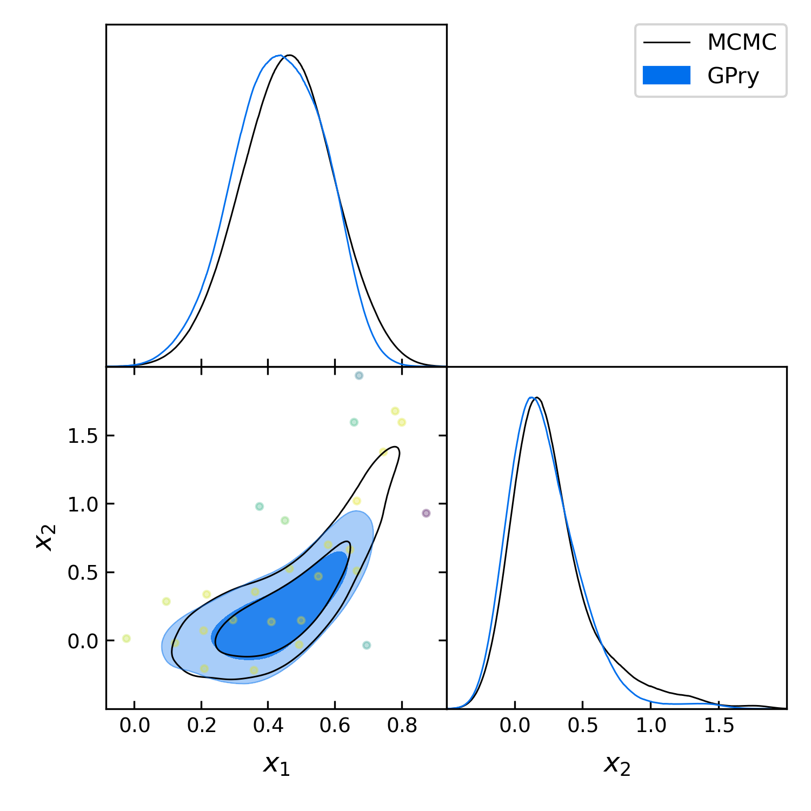
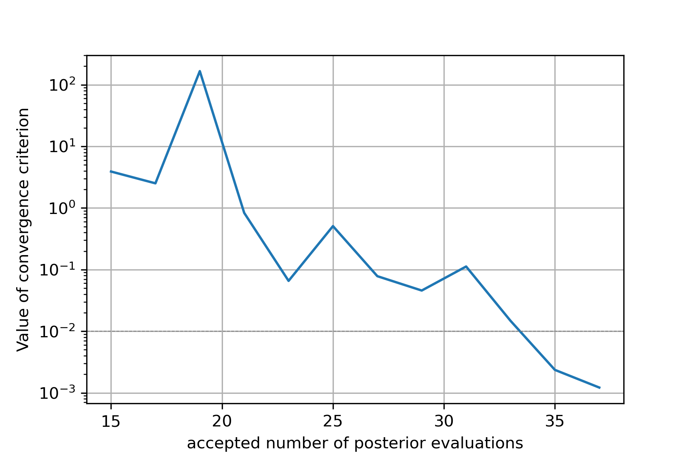

==================================
Advanced example to using GPry
==================================

This example shows some of the ways in which it is possible to customize the
Bayesian optimization loop. This will be done using a less standard
(non-gaussian) likelihood and we will walk through the modules and their
functionalities one by one.

Introduction
============

In this example we use a curved 2d variation of a guassian with the curving
degeneracy being generated by a 8-degree polynomial in the exponent.
It has the following (un-normalized) likelihood:

.. math::
    y(x) \sim \exp(-25\cdot(0.45-x_1)^2 - 20\cdot(x_2/2-x_1^4)^2)

with :math:`x=(x_1, x_2)^T`.

Since our GP maps the log-posterior and uses the log-likelihood as input the
likelihood function looks something like this::

    def log_lkl(x_1, x_2):
        return  -(10*(0.45-x_1))**2./4. - (20*(x_2/4.-x_1**4.))**2.

We could map this likelihood using the standard parameters of the
:meth:`run.run` function, which would recover the correct marginals.
Since the goal of this example is to showcase the ways in which the BO loop
can be modified we will change things though.

In order to make this as easy to understand as possible I will walk you through
every step of building the model, running it and plotting. I will reference the
individual modules where they are used. They contain further detailed
documentation on how to implement the different custom options as well as on
how to create custom classes which inherit from the base classes.

The GPry algorithm needs 5 basic building blocks to learn the shape of a
posterior distribution:

* The **model** which contains the log-likelihood and the prior.
* The **GP regressor** which is used to interpolate the posterior.
* The **Acquisition** object which determines the next sampling locations in
  each step of the Bayesian optimization loop.
* The **Convergence criterion** which determines when the GP has converged to
  the shape of the posterior distribution and and hence the Bayesian
  optimization loop should be stopped.
* The **options** dictionary setting the parameters for the actualy Bayesian
  optimization.

This is followed by a call to the run function which

The Model
=========
It is generally a good idea to define the model (i.e. the prior) first. For
this we need to create a Cobaya model object which contains the prior and
log-likelihood::

    from cobaya.model import get_model
    info = {"likelihood": {"curved_degeneracy": log_lkl}}
    info["params"] = {
        "x_1": {"prior": {"min": -0.5, "max": 1.5}},
        "x_2": {"prior": {"min": -0.5, "max": 2.}}
        }
    model = get_model(info)

For building the parts of our BO-loop we will need the dimensionality and the
prior bounds of our model which we get in the following way::

    n_d = model.prior.d()
    prior_bounds = model.prior.bounds()

If you have unbounded priors (like a normal distribution) use the keyword
``confidence_for_unbounded``
(see `here <https://cobaya.readthedocs.io/en/latest/params_prior.html#prior-class>`_)

The GP Regressor
================

The first part of our model which we have to define is the GP regressor. This
object also contains the kernel. It's hyperparameters are optimized in every
iteration of the BO loop.

Kernel
""""""

Even though the standard RBF kernel would work well enough for this likelihood
we will spice things up a bit by constructing a custom kernel which consists of
a Matèrn kernel with :math:`\nu=5/2` multiplied with a Constant kernel (and
non-dynamic, i.e. fixed bounds)::

    from gpry.kernels import Matern, ConstantKernel as C
    kernel = C(1.0, (1e-3, 1e3)) * Matern([0.1]*n_d, [[1e-5, 1e5]]*n_d, nu=2.5)

For details on the kernel construction see :mod:`kernels`.

.. note::
    For kernels containing length-scales (i.e. RBF and Matèrn kernel) the
    bounds can automatically be adjusted according to the size of the prior.

GP Regressor
""""""""""""

Now it's time to construct the actual GP regressor object. In addition to the
kernel this sets all the variables associated to the optimization procedure of
the hyperparameters as well as how the data is preprocessed.
Since we want our model to converge to the correct hyperparameters more robustly
we increase ``n_restarts_optimizer``(the number of restarts of the optimizer
for the GP's hyperparameters) to 20.

Furthermore it is generally a good idea to scale the parameter space to make it
a unit hypercube as is done as standard when calling the :meth:`run.run`
function::

    from gpry.gpr import GaussianProcessRegressor
    from gpry.preprocessing import Normalize_bounds, Normalize_y
    gpr = GaussianProcessRegressor(
        kernel=kernel,
        n_restarts_optimizer=20,
        preprocessing_X=Normalize_bounds(prior_bounds)
        )

Details can be found in the :mod:`gpr` and :mod:`preprocessing` modules.

.. note::
    The SVM which divides posterior samples into a *finite* and an *infinite*
    category is part of the GP regressor. I advise keeping it as standard but
    there are options for changing it. For this see the :mod:`svm` module.

.. note::
    We did not process the target values of the posterior distribution before
    fitting the GP. In our example this is not a bit problem as the range of
    the log-likelihood is relatively modest. If your log-likelihood ranges
    several orders of magnitude (i.e. when you have a big prior) it is usually
    a good idea to scale your target values using :class:`preprocessing.Normalize_y`

Acquisition
===========

The acquisition module contains both the acquisition function as well as the
optimization procedure for it. It operates similarly to the GP regressor module.

Acquisition function
""""""""""""""""""""

The acquisition function is the centerpiece of the Bayesion optimization
procedure and decides which point the algorithm samples next. The
:mod:`acquisition_functions` module has multiple inbuilt acquisition functions
as well as building blocks for custom acquistion functions which can be
constructed using the + and * operators. Since it tends to perform best we will
use the standard :class:`acquisition_functions.Log_exp` acquisition function
with a :math:`\zeta` value of 0.05 to encourage exploration (as we know that
the shape of the posterior distribution is not very gaussian)::

    from gpry.acquisition_functions import Log_exp
    af = Log_exp(zeta=0.1)

Then it is time for the actual GP Acquisition. For this we need to
build our instance of the :class:`gp_acquisition.GP_Acquisition` class which
also takes the acquisition function. Furthermore it needs the prior bounds
so it knows which volume to sample in. Furthermore like with the GP regressor
it is usually a good idea to scale the prior bounds to a unit hypercube
(assuming that the mode occupies roughly the same portion of the prior in each
dimension) as the optimizer tends to struggle with very different scales across
different dimensions::

    from gpry.gp_acquisition import GP_Acquisition
    acq = GP_Acquisition(
        prior_bounds,
        acq_func=af,
        n_restarts_optimizer=10,
        preprocessing_X=Normalize_bounds(prior_bounds)
        )

Convergence
===========

Next we need to set how the algorithm determines whether it has converged to
the correct posterior distribution. This is set using the :mod:`convergence`
module which offers a base :class:`convergence.ConvergenceCriterion` class
of which several inbuilt convergence criteria inherit. Using this base class
it is also possible to construct custom convergence criteria.

The standard :class:`convergence.CorrectCounter` convergence criterion works
best in most cases and I highly recommend using it. For educational purposes
we will use :class:`convergence.KL_from_draw_approx` which computes the KL
divergence assuming that the target distribution is a multivariate gaussian.
The KL divergence is computed by evaluating the GP at a number of sampling
locations which are drawn from the prior. This method is very "brute force" and
not very efficient though.

All convergence criteria are passed a prior object which is part of the model
instance and an options dict. The options that can be set depend on the choice
of the convergence criterion. In our case we set the KL divergence we want to
reach to :math:`10^{-2}`::

    from gpry.convergence import KL_from_draw_approx
    conv = KL_from_draw_approx(model.prior, {"limit": 1e-2})

Training parameters
===================

The training parameters which control the bayesian optimization loop are set in
the ``options`` dict. There we can also manually set the number of Kriging
believer steps per iteration and the maximum number of samples that the
algorithm draws from the posterior distribution before failing::

    options = {"max_init": 100, "max_points": 200,
               "n_initial": 8, "n_points_per_acq": 2}

.. note::
    If ``"n_points_per_acq"`` isn't set it defaults to the number of MPI
    processes to utilize the parallel evaluation of the posterior with Kriging
    believer.

Training
========

Running the Bayesian optimization loop is very simple. We just have to plug the
instances we have created into the :meth:`run.run` function and let it do it's
thing!::

    from gpry.run import run
    model, gpr, acquisition, convergence, options = run(
        model, gp=gpr, gp_acquisition=acq,
        convergence_criterion=conv, options=options)

MCMC
====

After having trained our GP we want to extract marginal parameters from it and
plot them. For this we run an MCMC on the GP which we do using the
:meth:`run.mcmc` function. Again we pass an options dictionary which contains
the training parameters. This uses the `Cobaya Sampler <https://cobaya.readthedocs.io/en/latest/sampler.html>`_::

    from gpry.run import mcmc
    options = {"mcmc": {"Rminus1_stop": 0.01, "max_tries": 1000}}
    updated_info, sampler = mcmc(model, gpr, convergence, options=options)

Validation
==========

.. note::
    This part is optional and only relevant for validating the contours that
    GPry produces. In a realistic scenario you would obviously not run a full
    MCMC on the likelihood.

For validating we run an MCMC on the true posterior. This is done by just
adding a sampler block to our initial model and then running the MCMC through
Cobaya::

    from cobaya.run import run as cobaya_run
    info["sampler"] = {"mcmc": {"Rminus1_stop": 0.01, "max_tries": 1000}}
    updated_info_mcmc, sampler_mcmc = cobaya_run(info)

Plotting with GetDist
=====================

Finally we want to generate a triangle plot with our marginal quantities. For
that we first need to extract the chains from our samplers (For both GPry and
the standard MCMC) which is done in the following way::

    from getdist.mcsamples import MCSamplesFromCobaya
    gdsamples_gp = MCSamplesFromCobaya(updated_info_gp,
                                       sampler_gp.products()["sample"])
    gdsamples_mcmc = MCSamplesFromCobaya(updated_info_mcmc,
                                         sampler_mcmc.products()["sample"])

Finally we want to generate the triangle plot to which we can add the training
samples using the :meth:`plots.getdist_add_training` method::

    import getdist.plots as gdplt
    from gpry.plots import getdist_add_training
    gdplot = gdplt.get_subplot_plotter(width_inch=5)
    gdplot.triangle_plot([gdsamples_mcmc, gdsamples_gp],
                         ["x_1", "x_2"], filled=[False, True],
                         legend_labels=['MCMC', 'GPry'])
    getdist_add_training(gdplot, model, gpr)

Furthermore we can simply plot the convergence history (value of KL divergence
vs number of posterior evaluations) using the :meth:`plots.plot_convergence`
method (here we plot against the number of accepted, i.e. *finite* points)::

    from gpry.plots import plot_convergence
    plot_convergence(convergence, evaluations="accepted")

As you can see the contours generated by GPry agree very well with the MCMC.
Furthermore you can see that the points spread apart rather far. This is due
to the relatively low choice of :math:`\zeta` in the acquisition function which
pushes the algorithm to favour exploration over exploitation.

Furthermore we see that the convergence criterion we chose is relatively
unstable. This was to be expected though as the choice wasn't really optimal.

The code for the example is available at :download:`../../examples/advanced_example.py`
