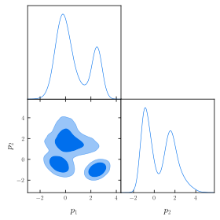
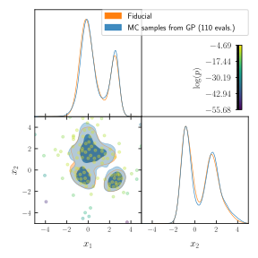
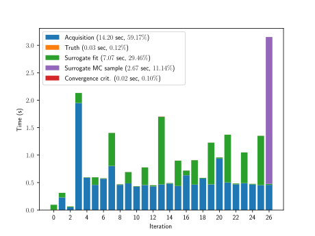
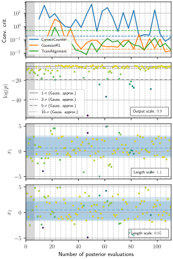

Advanced example
================

.. note::
   The code for the example is available at :download:`../../examples/advanced_example.ipynb` and :download:`../../examples/advanced_example.py`

The goal of this example is to show how to pass to the :class:`~gpry.run.Runner` options for the different components, as well as to discuss how GPry can be tuned for more complicated posteriors.

As before, let us define out likelihood, here as a gaussian mixture with 4 components:

.. code:: python

   import numpy as np
   from scipy.special import logsumexp
   from scipy.stats import multivariate_normal

   means = [
       [-0.5, -0.5],
       [0, 2],
       [0.5, 1.5],
       [2.5, -1]]
   covs = [
       [[0.25, -0.1], [-0.1, 0.25]],
       [[0.25, 0.], [0., 1]],
       [[1, -0.1], [-0.1, 0.25]],
       [[0.15, 0.05], [0.05, 0.15]],]

   rvs = [multivariate_normal(m, c) for m, c in zip(means, covs)]

   def logLkl(x, y):
       return logsumexp([rv.logpdf(np.array([x, y]).T) for rv in rvs])

   bounds = [[-5, 5], [-5, 5]]

We will draw some samples from the true distribution to use them as a fiducial reference in the runner. (This is of course optional.)

.. code:: python

   # Draw samples
   n_samples = 100000

   indices = np.random.choice(len(rvs), n_samples)
   samples = np.empty(shape=(n_samples, 2))
   for i, rv in enumerate(rvs):
       j_i = np.where(indices == i)[0]
       samples[j_i] = rv.rvs(size=len(j_i))

   # Let's plot the likelihood
   from getdist import MCSamples, plots

   mcsamples = MCSamples(samples=samples)
   g = plots.get_subplot_plotter()
   g.triangle_plot([mcsamples], filled=True)

Let us now create the :class:`~gpry.run.Runner` object.

We assume that we expect the likelihood to be multimodal, so we will tune some parameters to explore the distribution more efficiently and ensure convergence without missing any more (e.g. by making GPry more exploratory).

Below you can see the general structure for specifying options for sub-modules such as the surrogate model, the acquisition engine, and the convergence criteria. For example, for the acquisition engine we find in the :class:`~gpry.run.Runner` documentation that it is set with the ``gp_acquisition`` keyword. Then we look into the documentation of the :doc:`module_gp_acquisition` module to find the arguments that can be passed when initializing the :class:`~gpry.gp_acquisition.NORA` class, and specify them as ``gp_acquisition={"NORA": {option: value}}``.

.. code:: python

   from gpry import Runner
   checkpoint = "output/adv"

   runner = Runner(
       logLkl,
       bounds,
       options={
           # If there is multimodality, we are more likely to be
           # exploring simultaneously a couple of interesting areas
           # so we can evaluate more points per iteration
           "n_points_per_acq": "2d",
           # We will probably need more training samples than default
           # to represent a complicated posterior surface
           "max_total": 400},
       surrogate={
           "regressor": {
               # We want to adapt hyperparameters more often, to make
               # it more likely to converge earlier
               "n_restarts_optimizer": 20}},
       gp_acquisition={
           "NORA": {
               # We want to make the acquisition function more
               # exploratory (higher zeta_scaling)
               "acq_func": {"LogExp": {"zeta_scaling": 1.1}},
               # We want to re-run the nested sampler exploration as
               # often as possible, because we expect frequent changes
               "mc_every": 1}},
       convergence_criterion={
           # We want to make the CorrectCounter criterion necessary,
           # not just sufficient, so that it detects when a new region
           # is being explored. But we can also relax it a bit.
           "CorrectCounter": {"policy": "n", "reltol": 0.05, "abstol": "0.05s"},
           "GaussianKL": {"policy": "n"},
           "TrainAlignment": {"policy": "n"},},
       mc={
           # In the final MC run, we want more live points for a
           # better exploration of all the modes
           "nested": {"nlive": "100d"}},
       # Just for diagnostics. It will severely slow down the run if uncommented
       # plots={
       #     # Let's do a corner plot per iteration
       #     "corner": True, "timing": False, "convergence": False,
       #     "trace": False, "slices": False, "ext": "png"},
       checkpoint=checkpoint,
       load_checkpoint="overwrite")

   runner.set_fiducial_mc(samples)

And now we run it. This will take a little while, especially if the ``plots`` kwarg has been uncommented.

.. code:: python

   runner.run()
   runner.plot_progress()

