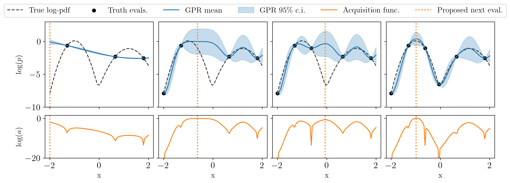
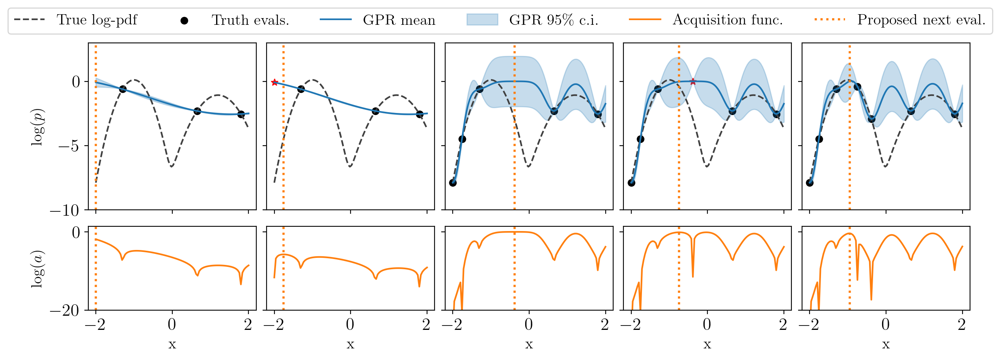
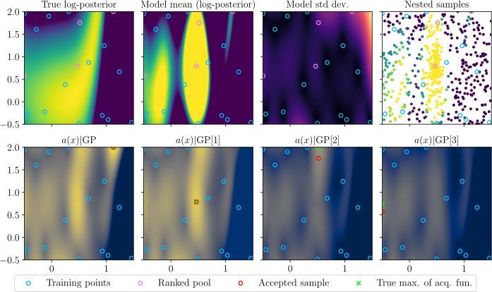
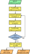

How does GPry work
==================

GPry creates an interpolating Gaussian Process (GP) model of the log-posterior density function. It does so using the least amount of evaluations possible. The locations in parameter space of these evaluations are chosen sequentially, so that they maximise the amount of information that can be obtained by evaluating the posterior there. This careful selection, together with the prior on the functional shape of the posterior that the GP imposes, helps GPry converge towards the true distribution using usually a factor :math:`\mathcal{O}(10^{-2})` of the evaluations needed by a traditional Monte Carlo sampler (such as MCMC or Nested Sampling).

Here we explain some of the key aspects of the GPry algorithm. Unless otherwise stated, what follows is not exclusive to or pioneered by GPry, but typical in active learning approaches.

Active learning of a Gaussian Process
-------------------------------------

GPry does not need any pre-training: it trains its surrogate model at run time by selecting optimal evaluation locations. The process of selecting these optimal locations based on current information is commonly known as **active learning**. It involves finding the maximum of an **acquisition function** measuring the amount of information about the true model expected to be gained by evaluating it at a given point. Acquisition functions must manage a good balance between **exploration** (getting an overall-good model of the true function) versus **exploitation** (prioritising a better modelling of the true function where its value is the highest). The default acquisition function used by GPry is described in section :doc:`module_acquisition_functions`. The automatic scaling with dimensionality of the balance between exploration and exploitation of this acquisition function is one of the novel aspects of GPry.

You can see the way active learning works in the following figure: the top plots show the current GP model, and the bottom ones the value of the acquisition function (for this simple example, the GP standard deviation times the exponential of the double of the GP mean); every column is an iteration of the algorithm. Notice how at every step an evaluation of the true function at the previous maximum of the acquisition function has been added:

.. note::

   This aspect of GPry is one of the main difference with **amortised** approaches, such as forward-modelling (or simulation-based) inference: the latter can produce inference at very low cost in exchange for some usually-costly pre-training; instead, the cost of inference in active learning approaches is higher (due both to the need for evaluating the true posterior at least a few times, and the overhead from active sampling), but they do not need pre-training.

Parallelising truth evaluation with kriging-believer
----------------------------------------------------

The active learning approach described above is sequential: one candidate is proposed for evaluation of the true posterior at a time. But being this evaluation often the slowest step, if one has sufficient computational resources available to perform :math:`n` posterior evaluations in parallel it would be desirable to obtain not just the next optimal location, but the next :math:`n` optimal ones.

However, simultaneously optimizing the acquisition function for a set of candidate locations is not a trivial problem: each of the candidates modifies the landscape of the acquisition function for the rest, so that we cannot simply assume that a set of local maxima is a viable solution.

But there is one way to give up some effectiveness (total information gained) of the solution in exchange for the possibility to turn this into a sequential problem: we can find the global maximum, assume an evaluation of the true model there, to which the **mean of the GP** is assigned, create with it an *augmented model*, and repeat this procedure using the augmented model, as many times as desired. This approach is called *kriging-believer* (KB), and though suboptimal, it at least includes the effect of the *exploration* term of the acquisition function, reducing the amount of redundant information with respect to a naive multiple-candidate solution.

Obviously, this procedure only makes sense up to a certain amount of iterations, or we risk assuming completely false information about the model. In GPry, we recommend at most a number of KB steps equals to the dimensionality of the problem (times some factor smaller or equal the number of expected posterior modes, if more than one).

In the following figure, to be compared with the one above, we only evaluate the posterior every two steps, the red stars in being the temporary kriging-believer evaluations that will be assigned their true values in the next iteration. It performs slightly worse, but has the advantage that the true posterior can be evaluated in parallel in batches of two points.

The acquisition engine
----------------------

It is implied above that the acquisition step of active learning involves a direct optimization of the acquisition function. GPry provides an acquisition engine that does precisely that, with some parallelization involved (see :class:`gp_acquisition.BatchOptimizer`).

GPry also introduces an alternative approach called NORA (Nested sampling Optimization for Ranked Acquistion). In it, the optimization of the acquisition function is swapped by a Nested Sampling exploration of the mean of the GP. The resulting sample is then ranked according to their acquisition function values, and subsequently re-ranked after sequentially augmenting the GP with the point at the top of the list. For more detail, see :class:`gp_acquisition.NORA`.

This approach has a number of advantages:

- NS is extremely efficiently parallelizable, and the raking of the NS sample too (but less efficiently). This greatly helps with the increase in dimensionality.
- This approach provides a better exploration of the parameter space, since NS probes the tails of the (surrogate) posterior, whereas in a direct optimization approach the problem of proposing good starting points for optimization is not trivial, and diverges worse with dimensionality than NS does.
- Since a sample from the mean GP is produced together with the candidates, better diagnosis and convergence tools are available at every iteration.

This approach to parallelising the acquisition process itself is another of GPry's novel aspects.

This figure demonstrates the NORA acquisition approach with 4 kriging-believer steps. The top row shows from left to right: The true function to be emulated, the current GP mean prediction (not very close to the truth, since this is an early iteration), its standard deviation, and, rightmost, the nested samples (dead points) from PolyChord. The bottom row shows the acquisition function for the unconditioned GP on the left, and for the conditioned GPs in the three right panels (each conditioned to all samples added to its left). Blue circles are current training samples, pink circles are samples that have been accepted into the ranked pool (top), and red circles are each respective optimal sample for the conditioned GP (bottom) selected from among the nested samples. It is visible that even with very coarse sampling the locations of the nested samples still cover the regions of high acquisition function well, and the maxima found are close enough to the true maxima (green) at every step.

Fitting the surrogate model
---------------------------

Updating the surrogate model with the new evaluations entails two distinct operations:

- Conditioning the Gaussian Process Regressor on the new, enlarged set of training samples.

- Choosing the optimal hyperparameters for the kernel given the new information.

Both operations entail a matrix inversion that scales as :math:`N^3`, where :math:`N` is the number of training samples. But in the first case, where hyperparameters stay constant, the inversion can be performed in a block-wise way, reducing the scaling down to :math:`N^2`. Because of the large scaling in the case in which kernel hyperparameters are optimised, and also because we do not expect the addition of new training samples to dramatically change the value of the optimal hyperparameters, we do not perform this operation at every iteration (or we may decide doing a mild version of it, such as only optimizing once from the optimum of the last iteration, instead of re-running the optimizer from different points in hyperparameter space).

.. note::

   At this step of the algorithm we also re-fit the pre-processors for the input and output data, as well as, if used, the classifiers aimed partitioning the parameter space into regions of high and low expected posterior value (see below).

The infinities classifier
-------------------------

Though in principle there is no lower limit to the log-posterior values that GPry can handle, there are reasons in practice for dealing with very small posterior values in a different way:

- Large negative log-posteriors, especially those that are literally or effectively minus infinity, can create instabilities in the GP interpolation, even when regularised.

- It is common that returning these values is the way likelihood implementations signify that somewhere along the computational pipeline a particular step failed, so it would not make sense to include it in the interpolation.

- Especially for likelihoods of noisy data, very-low-likelihood values have numerical (deterministic) noise, which does not make sense to model with the GPR.

Since GPry is an inference code, aiming at modelling probability density functions around their modes, it makes sense to censor such values, and if possible to predict them before evaluation of the true likelihood to prevent wasting time exploring a very-low-probability region and making the GPR model heavier.

To do that, we implement :doc:`classifiers for finite vs infinite<module_infinities_classifier>` values, where finiteness is defined as having a (true or predicted) value above a given /threshold/. This threshold is defined in terms of the difference between their log-posterior and the maximum found so far. Only points classified as /finite/ will form part of the GP Regressor's training set, whereas both point types will be used to retrain the classifiers at each iteration. The trained classifier(s) partition the coordinate space into regions for which the log-posterior is expected to be finite or not. When predicting log-posterior values using the surrogate models, the classifier is called before the regressor, and the latter is only run for classified-finite inputs.

Convergence check
-----------------

Since we do not have access in general to the target distribution, assuming GPry is converging towards the right target, we base our criteria on stability of the current surrogate model. By default, we use two criteria:

- That we do not get any more *surprises* when evaluating the true posterior at the proposal optimal locations, by comparing the obtained value with the mean GP prediction. See :class:`convergence.CorrectCounter`.

- That the current surrogate model does not diverge significantly from that of the previous iteration. For this last one, we need a Monte Carlo sample of the surrogate posterior, which, if we are using NORA, we already have at hand at every iteration. See :class:`convergence.GaussianKL`.

On top of these criteria, we check that the region where the GP is value highest corresponds to the location of the highest training samples, in case the GP is has temporarily high expectation value for a region with no training support, which is being explored at the moment. See :class:`convergence.TrainAlignment`. We use this as a necessary but not sufficient condition.

The full GPry algorithm
-----------------------

Here you can find a flow chart illustrating the full algorithm. More details about every step can be found in the following sections of the documentation.

