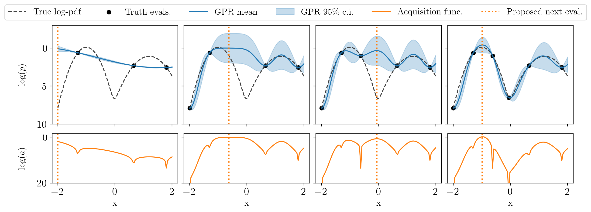
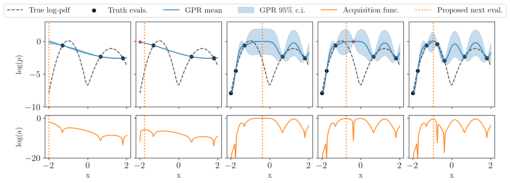
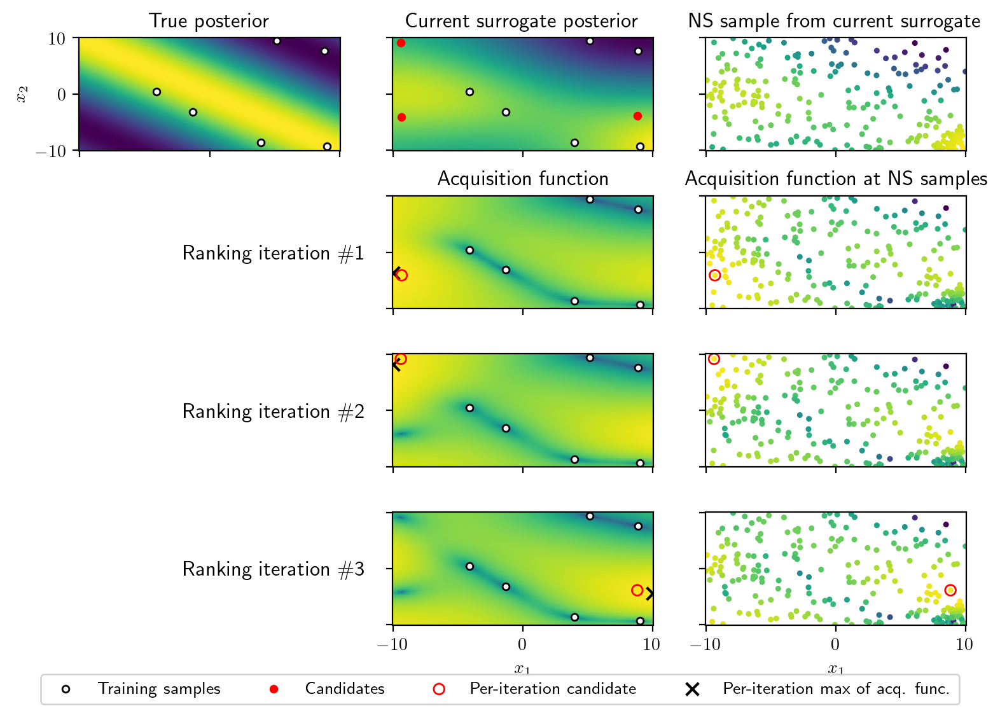
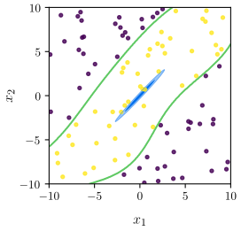
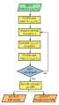

How does GPry work
==================

GPry creates an interpolating Gaussian Process (GP) model of the log-posterior density function. It does so using the smallest possible amount of evaluations of the true posterior. The locations in parameter space of these evaluations are chosen sequentially, so that they maximise the amount of information that can be obtained by evaluating the posterior there. This careful selection, together with the prior on the functional shape of the posterior that the GP imposes, helps GPry converge towards the true distribution needing usually a factor :math:`\mathcal{O}(10^{-2}\mathrm{-}10^{-3})` of the evaluations needed by a traditional Monte Carlo sampler (such as MCMC or Nested Sampling).

Here we explain some of the key aspects of the GPry algorithm. Unless otherwise stated, what follows is not exclusive to or pioneered by GPry, but typical in active learning approaches.

Active learning of a Gaussian Process
-------------------------------------

GPry does not need any pre-training: it trains its surrogate model at run time by selecting optimal evaluation locations. The process of selecting these optimal locations based on current information is commonly known as **active learning**. It involves finding the maximum of an **acquisition function** that measures the amount of information about the true model expected to be gained by evaluating it at a given point. Acquisition functions must manage a good balance between **exploration** (getting an overall-good model of the true function) versus **exploitation** (prioritising a better modelling of the true function where its value is the highest). The default acquisition function used by GPry is a linearized version of the exponentiated error bar of the GP, with a balancing term:

.. math::
   \alpha(x) = \mathrm{e}^{\mu_{\log p}(x) \cdot \zeta} \left( \mathrm{e}^{\sigma_{\log p}(x)} - 1 \right)\,,

where the first term, which depends on the predicted value of the GP, favours large-posterior regions of the parameter space (**exploitation**), and the second term, which depends on the GP standard deviation, favours regions of the parameter space away from the training samples (**exploration**). In `arXiv:2211.02045 <https://arxiv.org/abs/2211.02045>`_ we show that the optimal choice for the balancing term :math:`\zeta` is such that it decreases with the dimensionality :math:`d` of the parameter space as :math:`\zeta\approx d^{-0.85}`.

You can see the way active learning works in the following figure: the top plots show the current GP model, and the bottom ones the value of the acquisition function (for this simple example, the GP standard deviation times the exponential of the double of the GP mean); every column is an iteration of the algorithm. Notice how at every step an evaluation of the true function at the previous maximum of the acquisition function has been added:

.. note::

   This aspect of GPry (and of active-learning surrogate posterior methods in general) is one of the main differences with **amortised** approaches, such as simulation-based inference: the latter can produce inference at very low cost in exchange for some usually-costly pre-training, whereas active learning approaches have larger run-time inference costs, but can start from near-zero knowledge.

Parallelising truth evaluation with kriging-believer
----------------------------------------------------

The active learning approach described above is sequential: every iteration, we optimize the acquisition function and evaluate the true posterior at the maximum, which is added as a new training sample. But being this evaluation often the slowest step, if one has sufficient computational resources available to perform :math:`n` posterior evaluations in parallel, it would be desirable to obtain not just the next optimal location, but the next :math:`n` optimal ones.

However, simultaneously optimizing the acquisition function for a set of candidate locations is not a trivial problem: each of the candidates modifies the landscape of the acquisition function for the rest, so that we cannot simply assume that a set of local maxima is a viable solution.

But there is one way to give up some effectiveness (total information gained) of the solution in exchange for the possibility to turn simultaneous optimization into a sequential problem: we can find the global maximum, assume an evaluation of the true model there, to which the **mean of the GP** is assigned, create with it an *augmented model*, and repeat this procedure using the augmented model, as many times as desired. This approach is called *kriging-believer* (KB), and though suboptimal, it at least includes the effect of the *exploration* term of the acquisition function, reducing the amount of redundant information with respect to a naive multiple-candidate solution.

Obviously, this procedure only makes sense up to a certain amount of iterations, or we risk assuming completely false information about the model. In GPry, we recommend at most a number of KB steps equal to the dimensionality of the problem (times some factor smaller or equal the number of expected posterior modes, if more than one).

In the following figure, to be compared with the one above, we only evaluate the posterior every two steps. The red stars are the temporary kriging-believer evaluations that will be assigned their true values in the next iteration.

.. _nora_explanation:

The NORA acquisition engine
---------------------------

Above, we assume that active learning involves a direct optimization of the acquisition function. GPry provides an acquisition engine that does precisely that, with some parallelization involved (:class:`~gpry.gp_acquisition.BatchOptimizer`).

GPry also introduces an alternative approach called NORA (Nested sampling Optimization for Ranked Acquisition), presented in `arXiv:2305.19267 <https://arxiv.org/abs/2305.19267>`_ and implemented in the :class:`~gpry.gp_acquisition.NORA` class. NORA swaps the optimization of the acquisition function for a Nested Sampling (NS) exploration of the mean of the surrogate GP. The resulting sample is then ranked according to their acquisition function values, and subsequently re-ranked after sequentially augmenting the GP with the point at the top of the list.

In the following figure you can see in action the procedure of selecting a batch of candidates once a NS sample has been obtained: in the second row, the best candidate from the NS sample is selected according to their acquisition function, and used to condition the acquisition function in the following row, where the procedure is repeated. For comparison, we show the global optimum of the acquisition function, that the NS sample will have not reached, but will have approached significantly.

This approach to active learning has better **scaling with dimensionality** than naive optimization of the acquisition function because:

- NS scales better with dimensionality than optimization (in general), and it is extremely efficiently parallelizable.
- The ranking of the NS sample is also parallelizable (less efficiently so, but it is also cheaper than obtaining the NS sample).
- We only need a large number of evaluations of the mean of the GP, and not the standard deviation, which we would need if we were optimising the acquisition function (the ranking step only involves a small number of computations of the standard deviation).

On top of that, this approach provides a better exploration of the parameter space, since NS probes the tails of the (surrogate) posterior, whereas in a direct optimization approach the problem of proposing good starting points for optimization is non-trivial.

Finally, since a sample from the mean GP is produced together with the candidates, better diagnosis and convergence tools, such as KL divergences, are available at every iteration at no extra cost.

.. note::

   For this to work, you need to have installed one of the nested samplers, preferably PolyChord with MPI for greater performance (see :doc:`installation`).

Fitting the surrogate model
---------------------------

Once optimal candidates have been selected, the true posterior is evaluated there (if possible, in parallel), and the surrogate model is updated. On the side of the GP regressor, which is the most expensive part of the surrogate model, this update entails two distinct operations:

1. Conditioning the Gaussian Process Regressor on the new, enlarged set of training samples.

2. Choosing the optimal hyperparameters for the kernel given the new information.

Both of these operations involve the inversion of the kernel matrix, once for the simple conditioning, and many times for the hyperparameter optimization. The kernel matrix inversion typically scales as :math:`N^3`, with :math:`N` being the number of training samples. The number of training samples themselves at a given level of convergence grows with dimensionality, introducing a new factor of dimensionality scaling.

Because of this large scaling, and also because we do not expect the addition of new training samples to frequently change the value of the optimal kernel hyperparameters dramatically, we do not perform the second operation (full hyperparameter fit) at every iteration (or we may decide doing a mild version of it, such as only optimizing once from the optimum of the last iteration, instead of re-running the optimizer from different points in hyperparameter space).

.. note::

   At this step of the algorithm we also re-fit the pre-processors for the input and output data, as well as, if used, the SVM aimed at classifying regions of the parameter space as either interesting (if the posterior value is expected to be significantly high) or not (if the posterior value is expected to be very or infinitely low).

The infinities classifier
-------------------------

Though in principle there is no lower limit to the log-posterior values that GPry can handle, there are reasons in practice for dealing with very small posterior values in a different way:

- Large negative log-posteriors, especially those that are literally or effectively minus infinity, can create instabilities in the GP interpolation, even when regularised.
- It is common that returning these values is the way likelihood implementations signify that somewhere along the computational pipeline a particular step failed, so it would not make sense to include it in the interpolation.
- Especially for likelihoods of noisy data, very-low-likelihood values have numerical (deterministic) noise, which does not make sense to model with the GP regressor.

Since GPry is an inference code, aiming at modelling probability density functions around their modes, it makes sense to censor such values, and, if possible, to predict them before evaluation of the true likelihood to prevent wasting time exploring a very-low-probability region and making the GP regressor model heavier.

By default, GPry establishes as a *threshold* log-posterior value a large enough difference between the test log-posterior value and the maximum one achieved so far. This difference is scaled with dimensionality so that it corresponds to a certain amount of probability mass for a gaussian (see `arXiv:2211.02045 <https://arxiv.org/abs/2211.02045>`_ ).

Only points classified as *finite* according to this criterion will form part of the GP regressor training set, whereas both point types will be used to retrain a *support vector machine* (SVM) classifier at each iteration. The SVM classifier partitions the parameter space into *finite* and *minus infinity* regions. Points in parameter space that fall in the *minus infinity* region are automatically discarded during the acquisition phase before their true posterior evaluation.

Convergence check
-----------------

Since we do not have access in general to the target distribution, we base our criteria on stability of the current surrogate model (assuming it is converging towards the right target). By default, we use two criteria:

- That we do not get any more *surprises* when evaluating the true posterior at the proposed candidate locations. We check this by comparing the true value of the log-posterior with the mean GP prediction, and testing the difference against the expected dynamical range of the function. This is implemented in :class:`~gpry.convergence.CorrectCounter`.

- That the current surrogate model does not diverge significantly from that of the previous iteration. For this last one, we need a Monte Carlo sample of the surrogate posterior at every iteration, which, :ref:`if we are using NORA <nora_explanation>`, we already have obtained at the acquisition level step. This is implemented in :class:`~gpry.convergence.GaussianKL`.

On top of these criteria, we check that the region that concentrates most of the surrogate posterior mass corresponds to the location of the highest training samples. This is done to avoid converging on optimistic extrapolations (or overshootings) of the GP, where a temporary high expectation value is assigned to a region with no training support. This criterion, set as a necessary but not sufficient condition, is implemented in :class:`~gpry.convergence.TrainAlignment`.

The algorithm, putting everything together
------------------------------------------

The following flowchart provides a simple representation of most of the steps in the GPry algorithm:

