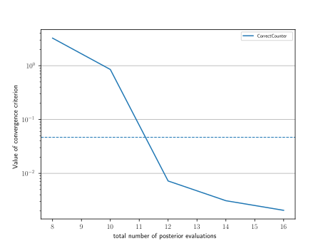
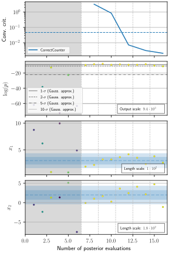
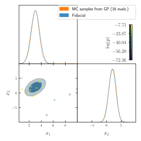

Introductory example to using GPry
==================================

Step 1: Setting up a likelihood function
----------------------------------------

Let's start with a very simple example where we want to characterize a 2d-Gaussian Likelihood:

.. math::
    y(x) \sim \mathcal{N}(x|\boldsymbol{\mu},\Sigma)

with :math:`\boldsymbol{\mu}=\pmatrix{3\\ 2},\ \Sigma=\pmatrix{0.5 & 0.4 \\ 0.4 & 1.5}`.

We need to define a **log-likelihood** function, which is the modelling target for GPry:

.. code:: python

    import numpy as np
    from scipy.stats import multivariate_normal

    mean = [3, 2]
    cov = [[0.5, 0.4], [0.4, 1.5]]
    rv = multivariate_normal(mean, cov)

    def logLkl(x, y):
        return rv.logpdf(np.array([x, y]).T)

with a uniform prior square in :math:`[-10, 10]`

.. code:: python

    bounds = [[-10, 10], [-10, 10]]

Step 2: Creating the Runner object
----------------------------------

The :py:class:`Runner <run.Runner>` manages model specification and the active sampling loop of GPry up to convergence, as well as allows for some post-processing and tests.

To initialise it, we pass it the log-likelihood function as first argument, and the prior bounds via the ``bounds`` keyword. <ore complicated prior specifications can be used by defining and passing as first argument a `Cobaya model <https://cobaya.readthedocs.io/en/latest/models.html>`_ (see :ref:`running_cobaya`).

Optionally, we will also pass a path to save checkpoints via the ``checkpoint`` argument. If passed, in order to prevent loss of data, you **must** decide a checkpoint policy (either ``"resume"`` or ``"overwrite"``). If set to ``"resume"`` the runner object will try to load the checkpoint and resume the active sampling loop from there; if set to ``"overwrite"`` it will start from scratch and overwrite checkpoint files which already exist.

.. code:: python

    from gpry.run import Runner
    checkpoint = "output/simple"
    runner = Runner(logLkl, bounds, checkpoint=checkpoint, load_checkpoint="overwrite")

In this example we will leave all training parameters (the choice of GP,
acquisition function, convergence criterion and options of the active sampling loop) as default.

Step 3: Running the active learning loop
----------------------------------------

Since all training parameters are chosen automatically all we have to do is to call the
:py:meth:`run <run.Runner.run>` function of the :py:class:`Runner <run.Runner>` object:

.. code:: python

    runner.run()

This will run the active sampling loop until convergence is reached. It also saves
the checkpoint files after every iteration of the bayesian optimization loop and creates
progress plots which are saved in ``[checkpoint]/images/`` (``./images/`` if checkpoint is
None).

Once converged, you can access the surrogate model and use it as a function for any purpose.

.. note::
   Internally GPry models the **log-posterior**, not the log-likelihood and that you need to hand GPry a single (nsamples, ndim) with the locations where you want to evaluate the surrogate.

To get the surrogate log-posterior or log-likelihood you can call either :py:meth:`Runner.logp <run.Runner.logp>` or :py:meth:`Runner.logL <run.Runner.logL>`

Let us compare GPry and the likelihood in the location `(1, 2)`: 

.. code:: python

   point = (1, 2)
   print(f"Log-lkl at (1,2): {logLkl(*point)}")
   print(f"surrogate at (1,2): {runner.logL(point)[0]}")

Both evaluations should produce similar numbers.

Step 4: Running a Monte Carlo sample on the final surrogate model
-----------------------------------------------------------------

The :py:class:`Runner <run.Runner>` object can also run an MC sampler on the GP in order to extract marginalised quantities. To do that, we use the :py:meth:`generate_mc_sample <run.Runner.generate_mc_sample>` method of the :py:class:`Runner <run.Runner>`. Leaving all option to their default, it will use the same sampler as for the active learning

.. code:: python

   runner.generate_mc_sample()

Samples are by default stored in the same folder as the checkpoint, inside a ``chains`` sub folder. They are stored as an attribute of the :py:class:`Runner <run.Runner>` and can be retrieved with the ``last_mc_samples()`` method.

Bonus: Plotting the results
---------------------------

Now that we have MC samples you can process and plot them the same way that you would do with any other MC samples.

The easiest way to get a corner plot though is to call the :py:meth:`plot_mc <run.Runner.plot_mc>` method of the :py:class:`Runner <run.Runner>` object which will generate a `GetDist` corner plot.

It includes the training set unless passed ``add_training=False``.

.. code:: python

   runner.plot_mc(updated_info, sampler)

.. image:: images/simple_surrogate_triangle.svg
   :width: 450
   :align: center

Bonus: Getting some extra insights
----------------------------------

You can do further plots about the progress of the active-learning loop using:

.. code:: python

   runner.plot_progress()

If you call this method without any arguments it results in the following plots:

* a histogram of the distribution time spent at different parts of the code (`timing.png`)
* the distribution of the training samples (`trace.png`)
* A plot showing the value(s) of all convergence criteria as function of the number of 
  posterior evaluations (`convergence.png`). The upper part of this plot shows the 
  convergence criterion, the second from the top the distribution of posterior values over 
  time, and the rest of them the distribution of samples per model parameter. The blue bands 
  in these parameter plots represent the 1-d marginalised posterior obtained with the 
  MC sampler, and won't appear if :py:meth:`runner.plot_progress <run.Runner.plot_progress>` is called before generating 
  an MC sample. If the training points were not centred around the blue band, the run has not 
  converged correctly. In this case, see :ref:`strategy-troubleshooting` for tips on fixing this issue.

.. image:: images/simple_timing.svg
   :width: 370

Validation
----------

.. note::
    This part is optional and only relevant for validating the contours that GPry produces. In a realistic scenario you would obviously not run a full MCMC on the likelihood and will need to follow the validation guidelines at :ref:`strategy-troubleshooting`.

Lastly we compare our result to the original gaussian:

.. code:: python

   # The parameter names need to be the same as for the log-likelihood function
   from getdist import MCSamples
   samples_truth = MCSamples(samples=rv.rvs(size=10000), names=["x_1", "x_2"])

   runner.plot_mc(add_samples={"Ground truth": samples_truth})

As you can see the two agree almost perfectly! And we achieved this with just a few evaluations of the posterior distribution!

The code for the example is available at :download:`../../examples/introductory_example.ipynb` and :download:`../../examples/introductory_example.py`
