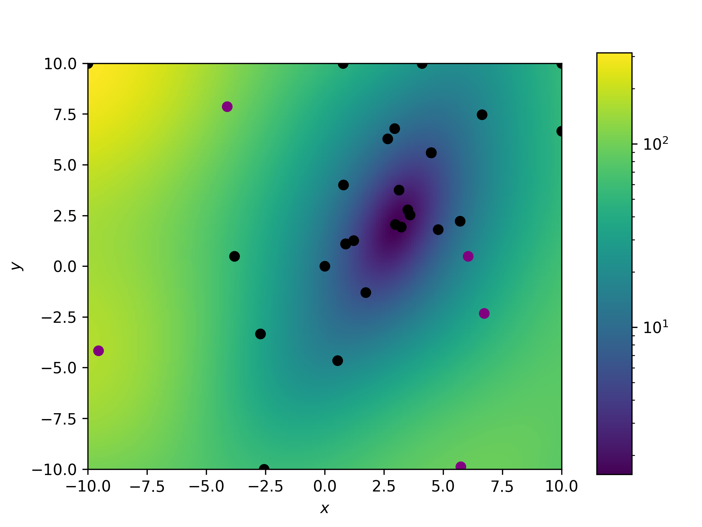

==================================
Introductory example to using GPry
==================================

The Function
============

Let's start with a very simple example where we want to characterize a 2d-Gaussian Posterior
with the PDF and a uniform prior square in :math:`[-10, 10]`

.. math::
    y(x) \sim \mathcal{N}(x|\boldsymbol{\mu},\Sigma)

with :math:`\boldsymbol{\mu}=\pmatrix{3\\ 2},\ \Sigma=\pmatrix{0.5 & 0.4 \\ 0.4 & 1.5}`.

Since `Cobaya` works with log-likelihoods we work with this.
Furthermore there are some numerical reasons why this is more
convenient

The code to build this function looks like this::

    import numpy as np 
    from scipy.stats import multivariate_normal

    rv = multivariate_normal([3,2],[[0.5, 0.4],[0.4, 1.5]])

    def f(x):
        return np.log(rv.pdf(X))

Let's see for reference how our function looks like (We plot the negative
log-posterior because of the log-scale)::

    a = np.linspace(-10., 10., 200)
    b = np.linspace(-10., 10., 200)
    A, B = np.meshgrid(a, b)

    x = np.stack((A,B),axis=-1)
    xdim = x.shape
    x = x.reshape(-1,2)
    Y = -1 * f(x)
    Y = Y.reshape(xdim[:-1])

    import matplotlib.pyplot as plt
    from matplotlib.colors import LogNorm

    fig = plt.figure()
    im = plt.pcolor(A, B, Y, norm=LogNorm())
    plt.xlabel(r"$x$")
    plt.ylabel(r"$y$")
    fig.subplots_adjust(right=0.8)
    cbar_ax = fig.add_axes([0.85, 0.1, 0.05, 0.8])
    cbar = fig.colorbar(im, cax=cbar_ax, orientation='vertical')

.. image:: images/Ground_truth.png
   :width: 600

The Model
=========

Once our function is defined it is time to build up our model.
The choices we need to make for this are:

    * Which kernel should we use?
    * Which acquisition function should we use?
    * Which training parameters should we choose for training?

In our case we will go with a very simple model consisting of an
anisotropic RBF kernel multiplied with a Constant kernel and
the Log-exp acquisition function with standard parameters 
(:math:`\zeta=1`)::

    from gpry.gpr import GaussianProcessRegressor
    from gpry.kernels import RBF, ConstantKernel as C
    from gpry.gp_acquisition import GP_Acquisition
    from gpry.acquisition_functions import Expected_improvement

	kernel = C(1.0, (1e-3, 1e3)) * RBF([1.0]*2, [[1e-5, 1e5]*2])
	gp = GaussianProcessRegressor(kernel=kernel,
		                     n_restarts_optimizer=20)
	af = Log_exp()

In case you wonder what these mean please refer to the :mod:`kernels`
and :mod:`acquisition_functions` modules.

Then it is time for the actual GP Acquisition. For this we need to
build our instance of the :class:`gp_acquisition.GP_Acquisition` class.
In our case we need some prior bounds (for our uniform prior)::

    bnds = np.array([[-10.,10.], [-10.,10.]])
    acquire = GP_Acquisition(bnds,
    			      acq_func=af,
                             n_restarts_optimizer=20)

Preprocessing the data for the GP regressor and the acquisition 
module will be discussed in the advanced example

.. note::
    In our example we set ``n_restarts_optimizer`` to quite a high value.
    In most applications it wouldn't have to be set this high, thus saving
    a lot of computation time.

Training 
========

We start by random-generating 3 initial points from which to start
our exploration of the function::

    init_1 = np.random.uniform(bnds[0,0], bnds[0,1], 3)
    init_2 = np.random.uniform(bnds[1,0], bnds[1,1], 3)

    init_X = np.stack((init_1, init_2), axis=1)
    init_y = f(init_X)

    gp.append_to_data(init_X, init_y, fit=True)

.. note::
    The part where initial values are drawn and fit to the GP will
    be automated later.

Now it is time to train our model. We will do this manually with
a loop::

    n_points = 2
    for _ in range(5):
        new_X, y_lies, acq_vals = acquire.multi_optimization(n_points=n_points)
        new_y = f(new_X)
        acquire.surrogate_model.append_to_data(new_X, new_y)

Let us look at this step by step:

    * First we specify how many points shall be
      acquired per step (here it's 2)
    * We want to do 5 acquisition runs (therefore the ``range(5)``)
    * The :meth:`acquire.multi_optimization` method optimizes the 
      acquisition function and returns the 2 points to query ``new_X``
      as well as the "fake" values of the surrogate model at these points.
    * The next line calls the real values of the function
    * These new values are appended to the training points of the model
      nested inside the :class:`gp_acquisition.GP_Acquisition` object.

Let us now see how the model has performed by plotting the GP prediction
(again we plot the negative prediction because of the log-scale)::

    # Getting the prediction
    gp = acquire.surrogate_model
    x_gp = gp.X_train_[:,0]
    y_gp = gp.X_train_[:,1]
    y_fit, std_fit = gp.predict(x, return_std=True)
    y_fit = -1 * y_fit.reshape(xdim[:-1])

    # Plot surrogate
    fig = plt.figure()
    im = plt.pcolor(A, B, y_fit, norm=LogNorm())
    plt.scatter(x_gp[:5], y_gp[:5], color="purple")
    plt.scatter(x_gp[5:], y_gp[5:], color="black")
    plt.xlabel(r"$x$")
    plt.ylabel(r"$y$")
    plt.xlim((-10, 10))
    plt.ylim((-10, 10))
    fig.subplots_adjust(right=0.8)
    cbar_ax = fig.add_axes([0.85, 0.1, 0.05, 0.8])
    cbar = fig.colorbar(im, cax=cbar_ax, orientation='vertical')

Here the purple dots are the initial samples we drew randomly while the black
dots are acquired points. The red dot (barely visible) is the real minimum.

Plotting with Cobaya
====================

Let us now compare triangle plots generated by Cobaya with

 #. The actual function
 #. The surrogate model

 For this we first need to import the modules::
    
    from cobaya.run import run
    from getdist.mcsamples import MCSamplesFromCobaya
    import getdist.plots as gdplt

1. Actual function
******************

Since the true function (and thus also the surrogate model) are defined
on the log-likelihood we can just go ahead and define a function which Cobaya
understands. This means basically just copying from the Cobaya examples::

    def true_func(x,y):
        return f(np.array([[x,y]]))

    info = {"likelihood": {"true_func": true_func}}
    info["params"] = {
        "x": {"prior": {"min": -10, "max": 10}, "ref": 0.5, "proposal": 0.2},
        "y": {"prior": {"min": -10, "max": 10}, "ref": 0.5, "proposal": 0.2}}

    info["sampler"] = {"mcmc": {"Rminus1_stop": 0.001, "max_tries": 1000}}

    updated_info, sampler = run(info)

    gdsamples_mcmc = MCSamplesFromCobaya(updated_info, sampler.products()["sample"])
    gdplot = gdplt.get_subplot_plotter(width_inch=5)
    gdplot.triangle_plot(gdsamples_mcmc, ["x", "y"], filled=True)

.. image:: images/Ground_truth_triangle.png
   :width: 600  
   
.. note::
   
    We set the precision parameters (specifically ``Rminus1_stop``) to be very
    accurate. In most examples a value of 0.005-0.01 would be enough.

2. Surrogate model
******************

For comparison we produce a triangle plot of the surrogate model
(Again with Cobaya)::

    def callonmodel(x,y):
        return gp.predict(np.array([[x,y]]))

    info = {"likelihood": {"gpsurrogate": callonmodel}}
    info["params"] = {
        "x": {"prior": {"min": -10, "max": 10}, "ref": 0.5, "proposal": 0.2},
        "y": {"prior": {"min": -10, "max": 10}, "ref": 0.5, "proposal": 0.2}}

    info["sampler"] = {"mcmc": {"Rminus1_stop": 0.001, "max_tries": 1000}}

    updated_info, sampler = run(info)

    gdsamples_gp = MCSamplesFromCobaya(updated_info, sampler.products()["sample"])
    gdplot = gdplt.get_subplot_plotter(width_inch=5)
    gdplot.triangle_plot(gdsamples_gp, ["x", "y"], filled=True)

.. image:: images/Surrogate_triangle.png
   :width: 600

Now we can compare the two to see if our GP finds the same contours as the MCMC::

    gdplot = gdplt.get_subplot_plotter(width_inch=5)
    gdplot.triangle_plot([gdsamples_mcmc, gdsamples_gp], ["x", "y"], filled=True,
        legend_labels=['MCMC', 'GP'])

.. image:: images/Comparison_triangle.png
   :width: 600
   
As you can see the two agree almost perfectly! And we achieved this with just 13
evaluations of the Posterior distribution!

The code for the example is available at :download:`../../examples/simple_example.py`
