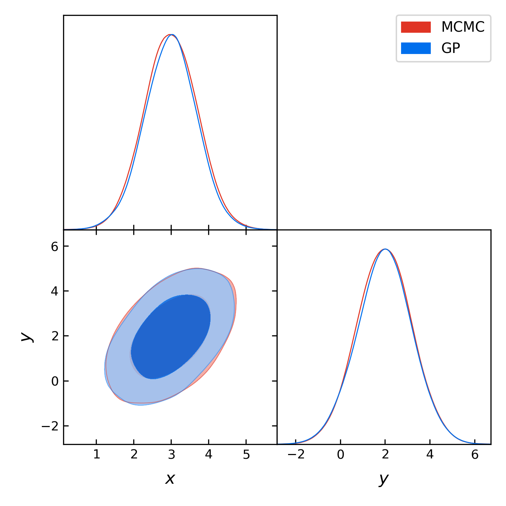

==================================
Introductory example to using GPry
==================================

The Function
============

Let's start with a very simple example where we want to characterize a 2d-Gaussian Likelihood
with the PDF and a uniform prior square in :math:`[-10, 10]`

.. math::
    y(x) \sim \mathcal{N}(x|\boldsymbol{\mu},\Sigma)

with :math:`\boldsymbol{\mu}=\pmatrix{3\\ 2},\ \Sigma=\pmatrix{0.5 & 0.4 \\ 0.4 & 1.5}`.

Since `Cobaya` works with log-likelihoods we work with this.
Furthermore there are some numerical reasons why this is more
convenient

The code to build this function looks like this::

    import numpy as np
    from scipy.stats import multivariate_normal

    rv = multivariate_normal([3, 2], [[0.5, 0.4], [0.4, 1.5]])

    def lkl(x, y):
        return np.log(rv.pdf(np.array([x, y]).T))

Let's see for reference how our function looks like (We plot the negative
log-posterior because of the log-scale).

.. image:: images/Ground_truth.png
   :width: 600

Building the model
==================

In this example we will use the :py:meth:`run <run.run>` function to characterize
the likelihood. For this we need to build a model which the run function
can use. This is done by building the model dictionary and getting the
model instance with the Cobaya `get_model <https://cobaya.readthedocs.io/en/latest/models.html?highlight=get_model#model.get_model>`_ function::

    from cobaya.model import get_model

    info = {"likelihood": {"normal": lkl}}
    info["params"] = {
        "x": {"prior": {"min": -10, "max": 10}},
        "y": {"prior": {"min": -10, "max": 10}}
        }

    model = get_model(info)

In this example we will leave all training parameters (the choice of GP,
acquisition function, convergence criterion and options of the Bayesian
optimization loop) as standard.

Running the model
=================

Since all training parameters are chosen automatically all we have to do is to
pass our model to the :py:meth:`run <run.run>` function::

    from gpry.run import run
    model, gpr, acquisition, convergence, options = run(model)

This will run the Bayesian optimization loop until convergence is reached.
Let's examine the output:

    * ``model`` is the Cobaya model which we put into the function at the
      beginning.
    * ``gpr`` is the :py:class:`GaussianProcessRegressor <gpr.GaussianProcessRegressor>`
      object trained on samples from the posterior distribution. This object
      contains the core information that are needed for further processing.
    * ``acquisition`` is the :py:class:`GP_Acquisition <gp_acquisition.GP_Acquisition>` object which contains the
      acquisition function and the details of it's optimization.
    * ``convergence`` is the :py:class:`Convergence_criterion <convergence.Convergence_criterion>` object which contains
      all details on the way of determining convergence of the bayesian
      optimization loop. In case of the standard convergence criterion this
      also contains an approximate covariance matrix which can later be used
      by the MCMC to accelerate convergence.
    * ``options`` is the dictionary containing the training parameters of the
      bayesian optimization loop.

Of these five inputs we need only three to finally sample from the GP with an
MCMC in order to get marginalized quantities.

Running the MCMC
================

For running the MCMC on the GP surrogate we will again leave all options as
standard and use the :py:meth:`mcmc <run.mcmc>` method. Calling this is again quite simple::

    from gpry.run import mcmc
    updated_info, sampler = mcmc(model, gpr, convergence)

This returns the same as the `Cobaya run function <https://cobaya.readthedocs.io/en/latest/input.html#run-function>`_
as it is essentially just a wrapper for it. For plotting etc. the sampler
object is the important part as it contains the chains.

Plotting with GetDist
=====================

The easiest way to get corner plots is to use `GetDist <https://getdist.readthedocs.io/en/latest/>`_ .
This program works seamlessly with Cobaya::

    from getdist.mcsamples import MCSamplesFromCobaya
    import getdist.plots as gdplt
    gdsamples_gp = MCSamplesFromCobaya(updated_info, sampler.products()["sample"])
    gdplot = gdplt.get_subplot_plotter(width_inch=5)
    gdplot.triangle_plot(gdsamples_gp, ["x", "y"], filled=True)

If you want to just store the chains and process them later consider using the
``output`` option.

.. image:: images/Surrogate_triangle.png
   :width: 600

**TBD: Put correct plot there when convergence criterion is fixed**.

.. note::
    GetDist is not a requirement for GPry nor Cobaya but a standalone package.
    Therefore this code will only work if you have installed GetDist.

Validation
==========

Lastly we run an MCMC on the likelihood directly to assess the accuracy of our
method::

    from cobaya.run import run as cobaya_run
    info = {"likelihood": {"true_lkl": lkl}}
    info["params"] = {
        "x": {"prior": {"min": -10, "max": 10}, "ref": 0.5, "proposal": 0.2},
        "y": {"prior": {"min": -10, "max": 10}, "ref": 0.5, "proposal": 0.2}}

    info["sampler"] = {"mcmc": {"Rminus1_stop": 0.01, "max_tries": 1000}}

    updated_info, sampler = cobaya_run(info)

    gdsamples_mcmc = MCSamplesFromCobaya(updated_info,
                                         sampler.products()["sample"])
    gdplot = gdplt.get_subplot_plotter(width_inch=5)
    gdplot.triangle_plot(gdsamples_mcmc, ["x", "y"], filled=True)

    gdplot = gdplt.get_subplot_plotter(width_inch=5)
    gdplot.triangle_plot([gdsamples_mcmc, gdsamples_gp], ["x", "y"], filled=True,
                         legend_labels=['MCMC', 'GP'])

.. image:: images/Ground_truth_triangle.png
   :width: 600

**TBD: Add correct plots**

As you can see the two agree almost perfectly! And we achieved this with just 13
evaluations of the Posterior distribution!

The code for the example is available at :download:`../../examples/simple_example.py`
