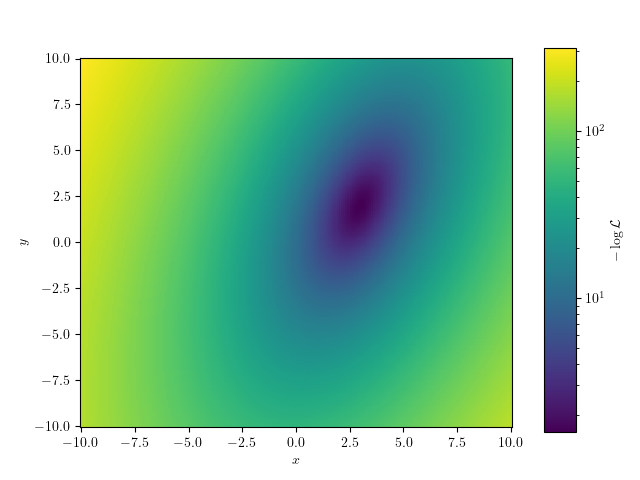
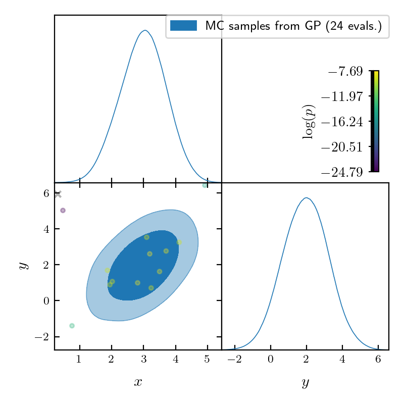
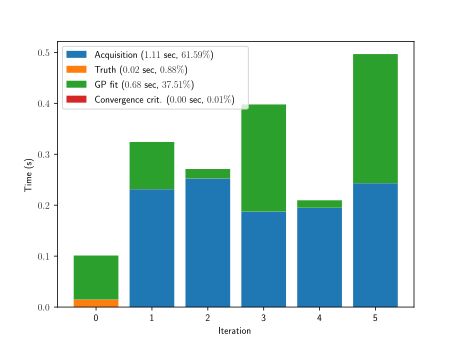
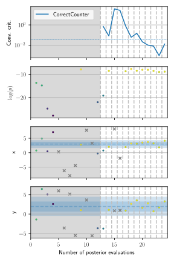
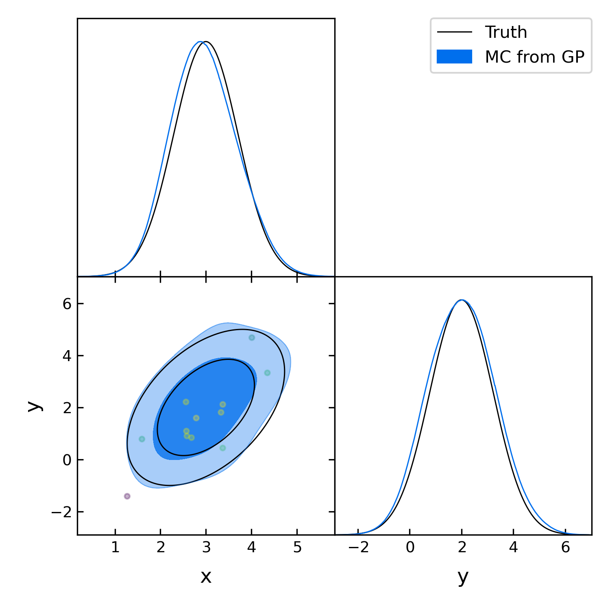

Introductory example to using GPry
==================================

The Function
------------

Let's start with a very simple example where we want to characterize a 2d-Gaussian Likelihood, with a uniform prior square in :math:`[-10, 10]`:

.. math::
    y(x) \sim \mathcal{N}(x|\boldsymbol{\mu},\Sigma)

with :math:`\boldsymbol{\mu}=\pmatrix{3\\ 2},\ \Sigma=\pmatrix{0.5 & 0.4 \\ 0.4 & 1.5}`.

We need to define a log-likelihood function, which is the modelling target for GPry.

The code to build this function looks like this:

.. code:: python

    import numpy as np
    from scipy.stats import multivariate_normal

    mean = [3, 2]
    cov = [[0.5, 0.4], [0.4, 1.5]]
    rv = multivariate_normal(mean, cov)

    def lkl(x, y):
        return rv.logpdf(np.array([x, y]).T)

    bounds = [[-10, 10], [-10, 10]]

Let's see for reference how our function looks like (We plot the negative
log-posterior because of the log-scale).

Creating the Runner object
--------------------------

The :py:class:`Runner <run.Runner>` manages model specification and the active sampling loop of GPry up to convergence, as well as allows for some post-processing and tests.

To initialise it, we pass it the log-likelihood function as first argument, and the prior bounds via the ``bounds`` keyword (more complicated prior specifications can be used by defining and passing as first argument a `Cobaya model <https://cobaya.readthedocs.io/en/latest/models.html>`_).

Optionally, we will also pass a path to save checkpoints via the ``checkpoint`` argument. If passed, in order to prevent loss of data, you **must** decide a checkpoint policy (either ``"resume"`` or ``"overwrite"``). If set to ``"resume"`` the runner object will try to load the checkpoint and resume the active sampling loop from there; if set to ``"overwrite"`` it will start from scratch and overwrite checkpoint files which already exist.

.. code:: python

    from gpry.run import Runner
    checkpoint = "output/simple"
    runner = Runner(lkl, bounds, checkpoint=checkpoint, load_checkpoint="overwrite")

In this example we will leave all training parameters (the choice of GP,
acquisition function, convergence criterion and options of the active sampling loop) as default.

Running the active learning loop
--------------------------------

Since all training parameters are chosen automatically all we have to do is to call the
:py:meth:`run <run.Runner.run>` function of the runner object:

.. code:: python

    runner.run()

This will run the active sampling loop until convergence is reached. It also saves
the checkpoint files after every iteration of the bayesian optimization loop and creates
progress plots which are saved in ``[checkpoint]/images/`` (``./images/`` if checkpoint is
None).

Once converged, you can access the surrogate model and use it as a function for any purpose. Notice that GPry models the log-posterior, not the log-likelihood defined above. If the prior is flat, we can recover the original function simply by adding the log-prior volume:

.. code:: python

   point = (1, 2)
   print(lkl(*point))
   print(runner.logp(point) + runner.log_prior_volume)

Both evaluations should produce similar numbers.

Running a Monte Carlo sample on the final surrogate model
---------------------------------------------------------

The ``Runner`` object can also run an MC sampler on the GP in order to extract marginalised quantities. To do that, we use the :py:meth:`generate_mc_sample <run.Runner.generate_mc_sample>` method of the ``Runner``. Leaving all option to their default, it will use an MCMC sampler (`the one of Cobaya <https://cobaya.readthedocs.io/en/latest/sampler_mcmc.html>`_):

.. code:: python

   runner.generate_mc_sample()

Samples are by default stored in the same folder as the checkpoint, inside a ``chains`` sub folder. They are stored as an attribute of the ``Runner`` and can be retrieved with the ``last_mc_samples()`` method.

Plotting the results
--------------------

We can plot a corner plot of result of the MC sampler,

Conveniently the ``Runner`` object can also create a corner plot of the last MC sampleby calling the :py:meth:`plot_mc <run.Runner.plot_mc>` method. It includes the training set unless passed ``add_training=False``.

.. code:: python

   runner.plot_mc(updated_info, sampler)

You can do further plots about the progress of the active-learning loop using:

.. code:: python

   runner.plot_progress()

This results among other in the following (click to enlarge): a histogram of the distribution time spent at different parts of the code, a collection of slices going through each of the training points and colored according to the value of the true likelihood at that point:

.. image:: images/simple_slices.svg
   :width: 370

And finally, it also plots the distribution of the training samples in the plot below:

The upper part of this plot shows the convergence criterion, the second from the top the distribution of posterior values over time, and the rest of them the distribution of samples per model parameter. The blue bands in these parameter plots represent the 1-d marginalised posterior obtained with the MC sampler, and won't appear if :func:`runner.plot_progress` is called before generating an MC sample. If the training points were not centred around the blue band, the run has not converged correctly [SEE ~TODO~]

Validation
----------

.. note::
    This part is optional and only relevant for validating the contours that GPry produces. In a realistic scenario you would obviously not run a full MCMC on the likelihood and will need to follow the validation guidelines at [SEE ~TODO~]

Lastly we compare our result to the original gaussian:

.. code:: python

   # The parameter names need to be the same as for the log-likelihood function
   names = "x", "y"
   from getdist import MCSamples
   samples_truth = MCSamples(samples=rv.rvs(size=10000), names=names)

   import os
   runner.plot_mc(
       add_samples={"Ground truth": samples_truth},
       output=os.path.join(checkpoint, "images/Comparison_triangle.png"),
   )
    plt.show(block=False)

As you can see the two agree almost perfectly! And we achieved this with just a few evaluations of the posterior distribution!

The code for the example is available at :download:`../../examples/simple_example.py`
