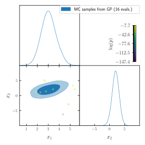
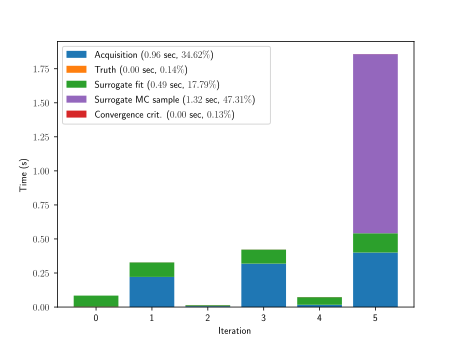
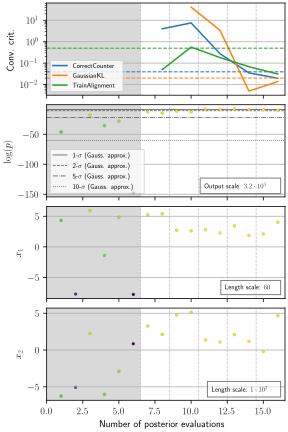
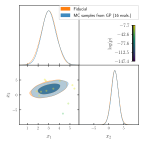

Introductory example
====================

.. note::
   The code for the example is available at :download:`../../examples/introductory_example.ipynb` and :download:`../../examples/introductory_example.py`

Step 1: Setting up a likelihood function
----------------------------------------

Let's start with a very simple example where we want to characterize a 2d-Gaussian Likelihood:

.. math::
    y(x) \sim \mathcal{N}(x|\boldsymbol{\mu},\Sigma) \qquad\text{with}\qquad
    \boldsymbol{\mu}=\pmatrix{3\\ 2},\ \Sigma=\pmatrix{0.5 & 0.4 \\ 0.4 & 1.5}\,.

We want to sample from the posterior within a uniform prior square :math:`[-10, 10]`.

We need to define a **log-likelihood** function, which is the modelling target for GPry and the prior bounds:

.. code:: python

    import numpy as np
    from scipy.stats import multivariate_normal

    mean = [3, 2]
    cov = [[0.5, 0.4], [0.4, 1.5]]
    rv = multivariate_normal(mean, cov)

    def logLkl(x, y):
        return rv.logpdf(np.array([x, y]).T)

    bounds = [[-10, 10], [-10, 10]]

Step 2: Creating the Runner object
----------------------------------

The :class:`~gpry.run.Runner` object manages model specification and the active sampling loop of GPry up to convergence. A didactic intro to this process can be found in section :doc:`how_does_gpry_work`. The :class:`~gpry.run.Runner` object also implements some post-processing and tests.

To initialize it, we pass it the log-likelihood function as first argument, and the prior bounds as the second argument (or via the ``bounds`` keyword). More complicated prior specification can be passed by defining and passing as first argument a Cobaya :external+cobaya:class:`~model.Model` (see :doc:`module_cobaya`).

Optionally, we can also pass a path where to save checkpoints via the ``checkpoint`` argument. If passed, in order to prevent loss of data, you **must** specify a checkpoint policy, either ``load_checkpoint="resume"`` or ``load_checkpoint="overwrite"``). If set to ``"resume"`` the runner object will try to load the checkpoint and resume the active sampling loop from there; if set to ``"overwrite"`` it will start from scratch and delete checkpoint files that may already exist.

.. code:: python

    from gpry import Runner
    checkpoint = "output/intro"
    runner = Runner(logLkl, bounds, checkpoint=checkpoint, load_checkpoint="overwrite")

In this example we will leave to their default values all training parameters: the choice of GP, acquisition function, convergence criterion, options of the active sampling loop...

Step 3: Running the active learning loop
----------------------------------------

Since all training parameters are chosen automatically all we have to do is to call the :func:`~gpry.run.Runner.run` method of the :class:`~gpry.run.Runner` object:

.. code:: python

    runner.run()

This runs the active sampling loop until convergence is reached. It also saves the checkpoint files after every iteration and creates progress plots which are saved in ``[checkpoint]/images/`` (or ``./images/`` if a checkpoint was not defined).

Once converged, you can access the surrogate model and use it as a function for any purpose.

.. note::
   Internally GPry models the **log-posterior**, not the log-likelihood.

To get the surrogate log-posterior or log-likelihood you can call respectively :func:`~gpry.run.Runner.logp` or :func:`~gpry.run.Runner.logL`, passing each a single point, or a ``(nsamples, ndims)`` array of locations where you want to evaluate the surrogate.

Let us compare the GPry surrogate model and the true likelihood at `(1, 2)`. Both evaluations should produce similar numbers.

.. code:: python

   point = (1, 2)
   print(f"True log-likelihood at {point}:      {logLkl(*point)}")
   print(f"Surrogate log-likelihood at {point}: {runner.logL(point)[0]}")

Step 4: Monte Carlo samples from the surrogate posterior
--------------------------------------------------------

As part of a final test before convergence, GPry will have run a Monte Carlo sampler on the surrogate model. If everything went well, you can use that sample as you would with one obtained with a traditional MC sampler: to extract marginalized quantities, create a corner plot of it, etc.

If a checkpoint has been defined, samples are stored in that same folder, inside a ``chains`` sub folder, in one or more ``.txt`` files. In those files, the order of the columns is ``weight log-posterior param_1 param_2 ...``.

.. note::

   If you would like to repeat this process to get a finer sample, you can generate a new one by calling the :func:`~gpry.run.Runner.generate_mc_sample` method with some options for the sampler:

   .. code:: python

       runner.generate_mc_sample(sampler={"nested": {"nlive": "50d"}})

The last MC sample can be retrieved with the :func:`~gpry.run.Runner.last_mc_samples` method:

.. code:: python

   runner.last_mc_samples(as_pandas=True)

It should produce something like:

.. code::

                     w        logpost      logprior           loglike           x_1            x_2
   0     6.484375e-108    -259.771915     -5.991465       -253.780450     -9.847782       6.090650
   1      1.962129e-98    -237.931479     -5.991465       -231.940014     -8.458978       8.142535
   2      4.161785e-83    -202.630838     -5.991465       -196.639374     -9.756148       0.557772
   3      1.769460e-82    -201.173572     -5.991465       -195.182108     -8.368915       5.245021
   4      7.961933e-79    -192.751869     -5.991465       -186.760405     -7.870831       5.892725
   ...             ...            ...           ...               ...           ...           ...
   1232   2.705340e-03      -7.561122     -5.991465         -1.569657      2.989332       1.986725
   1233   2.705458e-03      -7.561078     -5.991465         -1.569614      3.002605       2.014129
   1234   2.705503e-03      -7.561062     -5.991465         -1.569597      3.004512       1.995828
   1235   2.705524e-03      -7.561054     -5.991465         -1.569589      2.998646       2.009283
   1236   2.705533e-03      -7.561051     -5.991465         -1.569586      2.997139       1.988815

   1237 rows × 6 columns

Now that we have MC samples, we can process and plot them the same way that we would do with any other MC samples.

The easiest way to get a corner plot is to call the :func:`~gpry.run.Runner.plot_mc` method, which will generate a `GetDist` corner plot (it includes the training set unless passed ``add_training=False``).

.. code:: python

   runner.plot_mc()

Step 5: Bayesian evidence
-------------------------

When a nested sampler is used to generate samples from the surrogate model (it is, by default), GPry can provide an estimation of the Bayesian evidence of the model as the evidence of the mean of the Gaussian Process regressor. The associated standard deviation is that of the log-evidence computation using the nested sampler, and it does not include possible modelling errors by the GPR or the infinities classifier. For well-converged cases, it should be a reliable estimate regardless.

Let us compare the current estimate with the actual value (here the inverse of the prior volume, since the likelihood is normalized in parameter space):

.. code:: python

   print(f"NS log-evidence     = {runner.last_mc_logZ()[0]} +/- {runner.last_mc_logZ()[1]}")
   print(f"Actual log-evidence = {np.log(1 / np.prod(np.array(bounds)[:, 1] - np.array(bounds)[:, 0]))}")

.. code::

   NS log-evidence     = -5.823306518451101 +/- 0.180457722963657
   Actual log-evidence = -5.991464547107982

Bonus: Getting some extra insights
----------------------------------

You can do further plots about the progress of the active-learning loop using:

.. code:: python

   runner.plot_progress()

If you call this method without any arguments it produces the following plots:

* a histogram of the time spent at different parts of the code.
* if the run has converged, a corner plot of the final MC sample showing the training set (the same one you get when calling :func:`~gpry.run.Runner.plot_mc`).
* a convergence history ("trace") plot showing, as a function of posterior evaluations, the value(s) of all convergence criteria, the distribution of posterior values, and the distribution of samples per model parameter.

Validation
----------

.. note::
    This part is optional and only relevant for validating the contours that GPry produces. In a realistic scenario you would probably not be able to run a full MCMC/NS on the likelihood, and would need to follow instead the validation guidelines at :ref:`strategy-troubleshooting`.

Lastly, to compare our contours to the true Gaussian, we draw 10000 samples from it, set them as *fiducial samples* in the :class:`~gpry.run.Runner`, and plot the result:

.. code:: python

   truth_samples = rv.rvs(size=10000)
   runner.set_fiducial_mc(truth_samples)

   runner.plot_mc()

As you can see the two agree almost perfectly! And we achieved this with just a few evaluations of the posterior distribution!
