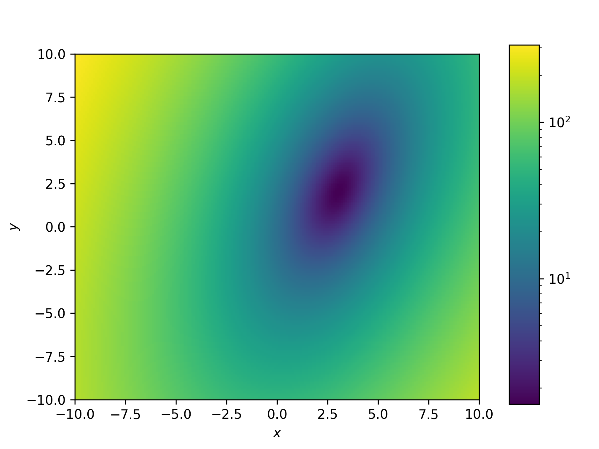
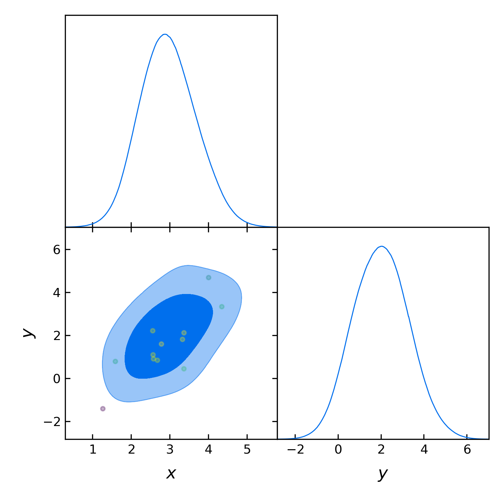

==================================
Introductory example to using GPry
==================================

The Function
============

Let's start with a very simple example where we want to characterize a 2d-Gaussian Likelihood
with the PDF and a uniform prior square in :math:`[-10, 10]`

.. math::
    y(x) \sim \mathcal{N}(x|\boldsymbol{\mu},\Sigma)

with :math:`\boldsymbol{\mu}=\pmatrix{3\\ 2},\ \Sigma=\pmatrix{0.5 & 0.4 \\ 0.4 & 1.5}`.

Since `Cobaya` works with log-likelihoods we work with this.
Furthermore there are some numerical reasons why this is more
convenient

The code to build this function looks like this::

    import numpy as np
    from scipy.stats import multivariate_normal

    rv = multivariate_normal([3, 2], [[0.5, 0.4], [0.4, 1.5]])

    def lkl(x, y):
        return np.log(rv.pdf(np.array([x, y]).T))

Let's see for reference how our function looks like (We plot the negative
log-posterior because of the log-scale).

Building the model
==================

In this example we will use the :py:class:`Runner <run.Runner>` object to do the active
sampling and get the final MC sample of the GP. For this we need to build a cobaya model
which the runner object understands. This is done by creating a model dictionary and
getting the model instance with the Cobaya
`get_model <https://cobaya.readthedocs.io/en/latest/models.html?highlight=get_model#model.get_model>`_ function::

    from cobaya.model import get_model

    info = {"likelihood": {"normal": lkl}}
    info["params"] = {
        "x": {"prior": {"min": -10, "max": 10}},
        "y": {"prior": {"min": -10, "max": 10}}
        }

    model = get_model(info)

In this example we will leave all training parameters (the choice of GP,
acquisition function, convergence criterion and options of the Bayesian
optimization loop) as standard.

Creating the Runner object
==========================

The runner object handles both the GP interpolation/active sampling and can also run an
MC sampler on the GP in order to extract marginalised quantities. Furthermore we can
specify a location where checkpoint files and progress plots are stored.

Let's create our :py:class:`Runner <run.Runner>` object::

    from gpry.run import Runner
    checkpoint = "output/simple"
    runner = Runner(model, checkpoint=checkpoint, load_checkpoint="overwrite")

.. note::
    If you set a checkpoint path you **must** decide a checkpoint policy (either "resume"
    or "overwrite"). If set to "resume" the runner object will try to load the checkpoint
    and resume from there, if set to "overwrite" it will start from scratch and overwrite
    checkpoint files which already exist.

Running the model
=================

Since all training parameters are chosen automatically all we have to do is to call the
:py:meth:`run <run.Runner.run>` function of the runner object::

    runner.run()

This will run the Bayesian optimization loop until convergence is reached. It also saves
the checkpoint files after every iteration of the bayesian optimization loop and creates
progress plots which are saved in ``[checkpoint]/images/`` (``./images/`` if checkpoint is
None).

Running the MCMC
================

For running the MCMC on the GP surrogate we will again leave all options as
standard and use the :py:meth:`generate_mc_sample <run.Runner.generate_mc_sample>` method
of the runner. Calling this is again quite simple::

    updated_info, sampler = runner.generate_mc_sample()

This returns the same as the `Cobaya run function <https://cobaya.readthedocs.io/en/latest/input.html#run-function>`_
as it is essentially just a wrapper for it.

.. note::
    If you want to just store the chains and process them later consider using the
    ``output`` option.

Plotting with GetDist
=====================

.. warning::
    GetDist is not a requirement for GPry nor Cobaya but a standalone package.
    Therefore this code will only work if you have (manually) installed GetDist.
    We highly encourage installing it though for a seamless experience.
    GetDist can be installed ` here <https://pypi.org/project/GetDist/>`_

Conveniently our runner object can also create a corner plot by calling the
:py:meth:`plot_mc <run.Runner.plot_mc>` method. It needs the output that we got in the
last step. The plot is saved in the same location as the progress plots::

    runner.plot_mc(updated_info, sampler)

.. note::
    As standard :py:meth:`plot_mc <run.Runner.plot_mc>` plots the contours of the
    marginalised quantities and the training samples on top. If you are only interested
    in the contours use ``add_training=False``

Validation
==========

.. note::
    This part is optional and only relevant for validating the contours that
    GPry produces. In a realistic scenario you would obviously not run a full
    MCMC on the likelihood.

Lastly we compare our result to the original gaussian (look into GetDist's/Cobaya's
documentation if you are confused what this code does)::

    from getdist.gaussian_mixtures import GaussianND
    from getdist.mcsamples import MCSamplesFromCobaya
    import getdist.plots as gdplt
    from gpry.plots import getdist_add_training
    gpr = runner.gpr
    gdsamples_gp = MCSamplesFromCobaya(updated_info, sampler.products()["sample"])
    gdsamples_truth = GaussianND(mean, cov, names=list(info["params"]))
    gdplot = gdplt.get_subplot_plotter(width_inch=5)
    gdplot.triangle_plot([gdsamples_truth, gdsamples_gp], list(info["params"]),
                         filled=[False, True],
                         legend_labels=['Truth', 'MC from GP'])
    getdist_add_training(gdplot, model, gpr)

.. image:: images/simple_comparison_triangle.png
  :width: 600

As you can see the two agree almost perfectly! And we achieved this with just 16
evaluations of the posterior distribution!

The code for the example is available at :download:`../../examples/simple_example.py`
