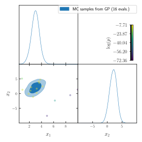

Drawing MC samples from the surrogate posterior
===============================================

Once the learning loop has converged, drawing Monte Carlo samples from the surrogate model can be done at a very low computational cost.

.. note::

   By default, an MC sampler will have already been run at convergence for diagnosis purposes.

The simplest way to create an MC sample from the surrogate model is to call the :py:meth:`run.Runner.generate_mc_sample>` method of the :py:class:`Runner <run.Runner>` object. This method can be called any number of times, and the previous samples will be overwritten.

The MC algorithms available are the same nested samplers used by the :class:`NORA acquisition engine <gp_acquisition.NORA>` (see :ref:`installing_nested_samplers`), as well as the MCMC sampler from `Cobaya <https://cobaya.readthedocs.io>`_.

To generate new MC samples with default settings (uses the best nested sampler available by default):

.. code:: python

   runner.generate_mc_sample()

To retrieve the last generated samples, use the :meth:`run.Runner.last_mc_samples>` method. By default, it returns the samples as a dictionary. A pandas DataFrame can be generated as:

.. code:: python

   mc_samples_dict = runner.last_mc_samples(as_pandas=True)
   print(mc_samples_dict)

.. code::

          w    logpost  logprior   loglike       x_1       x_2
   0    1.0 -11.598237 -5.991465 -5.606773  4.896665  4.535424
   1    1.0 -11.286758 -5.991465 -5.295293  1.117008 -0.148755
   2    1.0 -11.262597 -5.991465 -5.271132  4.806402  4.460790
   3    1.0 -10.672167 -5.991465 -4.680702  4.313618  1.246258
   4    1.0 -10.670824 -5.991465 -4.679360  2.068655 -1.042577
   ..   ...        ...       ...       ...       ...       ...
   237  1.0  -7.570368 -5.991465 -1.578904  3.024982  2.123483
   238  1.0  -7.570094 -5.991465 -1.578629  3.067862  2.078437
   239  1.0  -7.569896 -5.991465 -1.578432  3.056808  1.987092
   240  1.0  -7.565576 -5.991465 -1.574112  2.979181  1.981701
   241  1.0  -7.565178 -5.991465 -1.573713  2.996010  1.998560

   [242 rows x 6 columns]

Samples are also stored by default in the same folder as the checkpoint, inside a ``chains`` sub folder. The order of the columns in that file are ``weight log-posterior param_1 param_2 ...``.

To plot the results of the MC sampler, you can load these samples into your favourite analysis/plotting package, or use the :meth:`run.Runner.plot_mc` method:

.. code:: python

   runner.plot_mc(add_training=True)

How to draw finer MC samples
----------------------------

Since sampling from the surrogate posterior can be done at a very low cost, it may be worth re-running the final MC sample
with higher precision:

- If using a nested sampler, increasing ``nlive`` and ``num_repeats``, with ``d`` meaning a factor of the dimensionality, and reducing the ``precision_criterion`` for the convergence of the evidence integration:

  .. code:: python

     runner.generate_mc_sample(
         sampler={"nested": {"nlive": "100d", "num_repeats": "10d", "precision_criterion": 0.005}}
     )

- If using Cobaya's MCMC sampler (faster, produces more samples), decreasing the Gelmann-Rubin ``R-1`` test limits for means and covariances:

  .. code:: python

     runner.generate_mc_sample(
         sampler={"mcmc": {"Rminus1_stop": 0.005, "Rminus1_cl_stop": 0.05}}
     )

Can one draw samples from the surrogate *likelihood* instead?
-------------------------------------------------------------

The :class:`run.Runner` class implements the :meth:`run.Runner.logL` method as the reconstructed log-likelihood from the surrogate log-posterior. This should return a close approximation to the true likelihood within the prior bounds, except, in the case of non-uniform priors, for regions where the prior density is very low.

Thus, conversely, if the targeted support is well contained within the prior bounds of the surrogate model, one can pass the :meth:`run.Runner.logL` method to an MC sampler to produce samples using a different prior.
