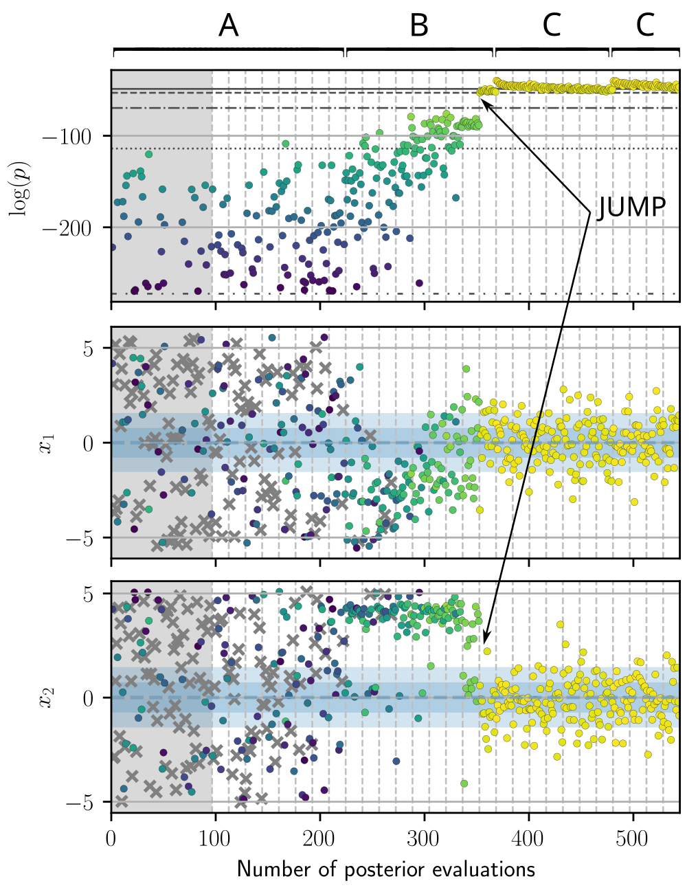
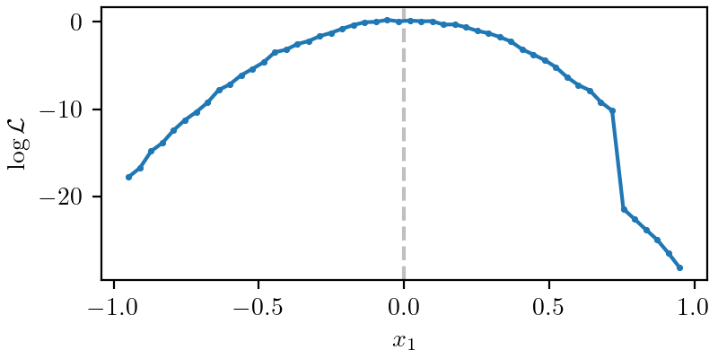
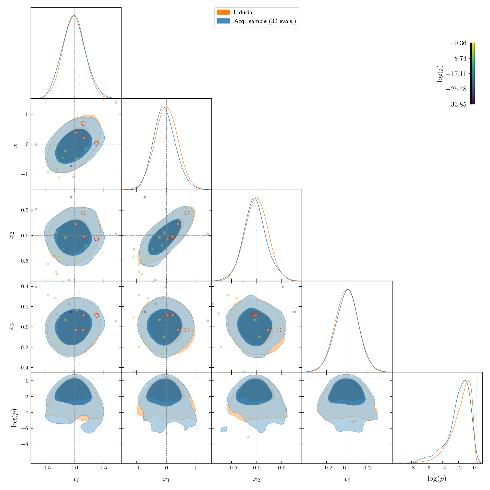

.. _strategy-troubleshooting:

Strategy and troubleshooting
============================

If GPry does not converge for your problem with the default settings, or does not do so efficiently enough, here is a list of things to try, from easier and more general, to more specific diagnoses.

.. note::

   In general, if there are problems, it is recommended to use the NORA [TODO: add reference] acquisition engine, since it allows for better diagnosis tools.

.. _help_healthy:

How does healthy convergence look like?
---------------------------------------

In order to identify possible problems, it is useful to know how convergence looks like in a trace plot [TODO: reference to trace plots]. Here we show the trace for the target log-posterior and the first 2 variables of a 16-dimensional Gaussian for which GPry has successfully converged, and mark its difference stages:

- **A**: In high-dimensional cases and cases where the mode is very small with respect to the posterior, there will be an initial phase where GPry is **constraining** the problem towards the relevant region of the prior where the value of the posterior density is significant, while the SVM learns the classification between the areas with zero and non-zero posterior density. A lot of points are rejected at this stage (crosses in the :math:`x_1` and :math:`x_2` traces), and the log-posterior seems not to be climbing.
- **B**: The problem has already being constrained, and GPry is mostly **optimizing** towards the top of the mode, with the acquisition function value of new proposals being driven by their expected log-posterior.
- **C**: The maximum (or at least the one discovered so far) has been reached, and GPry is now **diffusing**, with the acquisition function value of new proposals now also driven by their standard deviation. **Convergence** should happen at some point in this phase, if the convergence criterion is not overly strict.

Notice the **jump** indicated in the image (and a smaller one later in the trace): either/both because of the acquisition of a new point with higher posterior density or a strong re-fit of the hyperparameters, the GPR model now predicts a new region with high posterior density, where new points are being proposed.

If your run is not presenting this sort of progress, or seems stuck in one of the phases, you can find below a list of approaches that could help.

.. _help_plot_slice:

I. Learn more about your problem
--------------------------------

Usually, plotting a slice of the posterior/likelihood is useful to uncover features that may be spoiling the Gaussian Process modelling. To do this, you can use the slice plotter implemented in :func:`plots.plot_slices_func`, preferably using a point close to the posterior mode.

For example, in the following slice we can see two different relevant features:

- The likelihood seems to have some numerical noise. To deal with this, you should pass a non-null value for the ``noise_level`` of the GPR [TODO: add reference], here approximately ``noise_level=0.1``.
- There is a discontinuity at :math:`x_1\approx 0.75`. In general, this would spoil a GPR fit, that expects a nearly-continuous function. Ideally, this would persist in the rest of the dimensions, without presenting degeneracies, and a prior cut :math:`x_1 < 0.75` could be implemented. Otherwise, if the discontinuity leads to posterior values that are low enough, one can choose the ``inf_threshold`` of the GPR [TODO: add reference] so that it always discards these values, here approximately ``inf_threshold=20``.

.. note::

   In general it is not recommended to use the slice plot to derive a prior cut from it, since there may be parameter degeneracies in the posterior that are not visible in a slice and could let to part of the mode being left out.

II. Incorporate known information to simplify the problem
---------------------------------------------------------

- Cut the prior to more tightly contain the region where the mode is expected. To help you with this, you can :ref:`plot a slice of the posterior <help_plot_slice>`, but be careful not to cut to tight: degeneracies between parameters that are not visible in a slice can leave out parts of the mode.
- If available, use a different parameterization for which the posterior may be more Gaussian and less correlated.
- [TODO] Something about initialization

III. Try GPry on an easier version of the same problem
------------------------------------------------------

- Simplify the likelihood computation (e.g. downgrading its precision, turning off contributions) to be able to iterate faster until the problem is solved.
- Fix a number of parameters to their fiducial/expected value to test on a lower-dimensional version of the problem.

In this simpler scenario, you may be able to get an approximate MCMC/Nested sample to compare with, and :ref:`use it as a reference <help_reference>`.

.. _help_reference:

IV. Supply a reference (approximate) MC sample if available
-----------------------------------------------------------

If you have a precise or approximate fiducial MC sample of the posterior, you can pass it to the :class:`run.Runner` instance before calling the :func:`~gpry.run.Runner.run`` method using the :meth:`run.Runner.set_fiducial_MC` method:

.. code:: python

   runner = Runner([...])
   runner.set_fiducial_MC(X, logpost=..., weights=...)

Note that you can pass instead the loglikelihood (via the ``loglike`` arg), if you are letting GPry compute the prior density.

Similarly, you can pass a single fiducial reference point (e.g. the expected MAP or best fit) using :meth:`run.Runner.set_fiducial_point` method (same arguments, this time scalars).

This fiducial MC and point will be shown in the :ref:`progress plots <turn_on_plots>` and those generated by :meth:`run.Runner.plot_mc`, and will let you learn about where GPry is mapping versus where the mode actually is.

.. _turn_on_plots:

IV. Turn on the debug output and progress plots
-----------------------------------------------

There are two settings of the Runner :class:`run.Runner` that can help with debugging deficient convergence:

- ``verbose``: if set to 4 (by default 3), GPry will produce much more output, including the exact coordinates of the proposed points and the true log-posterior density obtained at evaluation. This can sometimes reveal unexpected behaviour by the true model.
- ``plots``: if set to ``True``, GPry will produce some plots at the end of every iteration. Plots that are particularly expensive are skipped by default, and need to be requested explicitly. For a full set of progress plots, instead of ``True``, set ``plots={[plot_type]: True, [...]}`` where plot types are the arguments of the :meth:`run.Runner.plot_progress` method.

  In particular, ``corner: True`` can reveal if GPry is mapping the right region, especially when a :ref:`reference MC sample <help_reference>` has been passed: if the acquisition MC sample seems stable through iterations and mostly on top of the training set, maybe the convergence criterion is too stringent, or the likelihood is more numerically noisy than the `noise_level` parameter accounts for.

  Though also expensive, ``slice: True`` is particularly useful for diagnosing misbehaviour by the SVM infinities classifier.

V. Start with high-precision settings
-------------------------------------

As expected, turning on the `precision paramters` of the algorithm can make it more likely to converge in exchange for additional computational costs. Two good starting points are:

- If using NORA [TODO: reference], decreasing ``mc_every`` to ``1``, so that a full NS is run at every iteration. This is specially recommended if a ladder-like progress with frequent jumps (see ) is observed in the trace plot (see :ref:`help_healthy`).

- You can increase the frequency with which hyperparameters are fit with the ``fit_full_every`` option of the runner. This will make it more likely that the best GPR configuration is reached as soon as possible, but at a very high computational cost for dimensions larger than 10.
